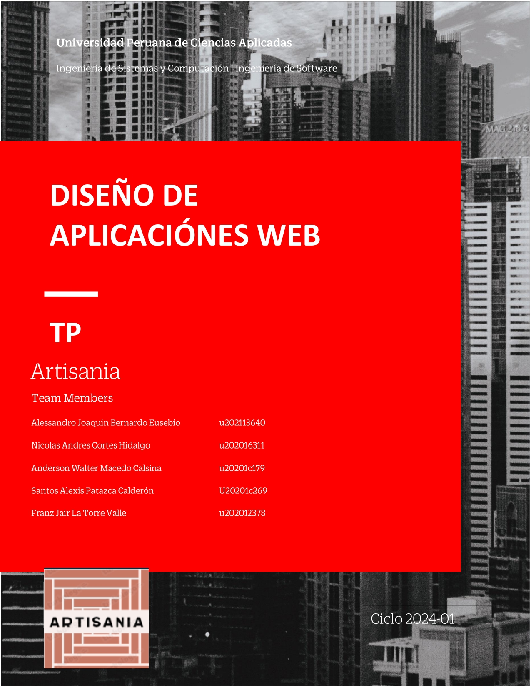
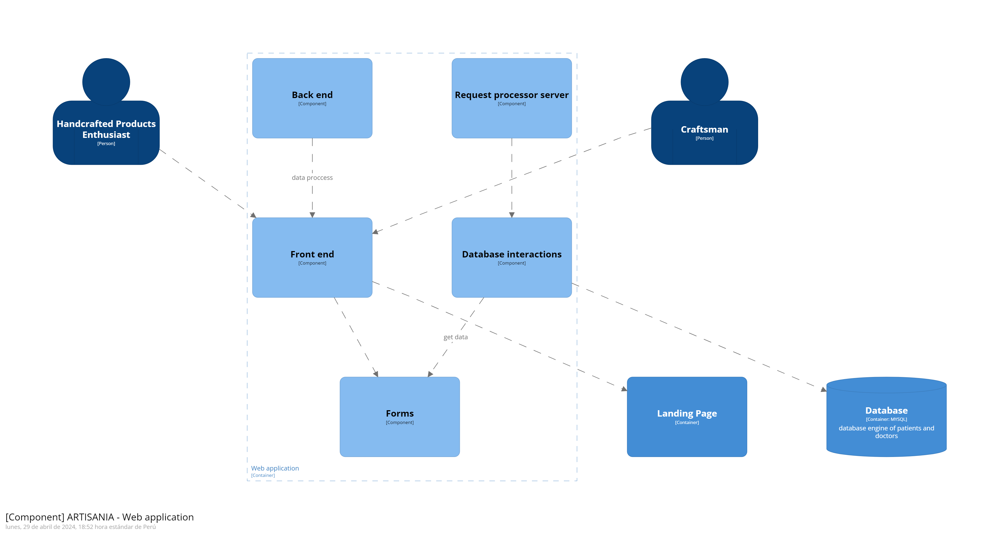
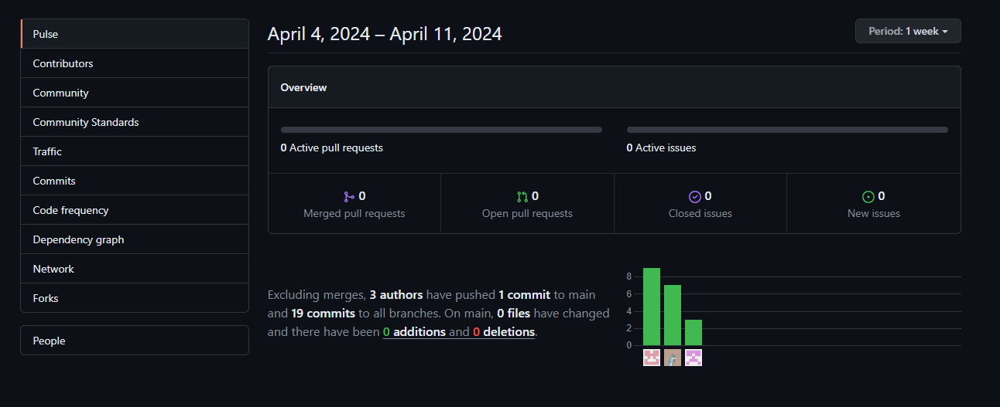
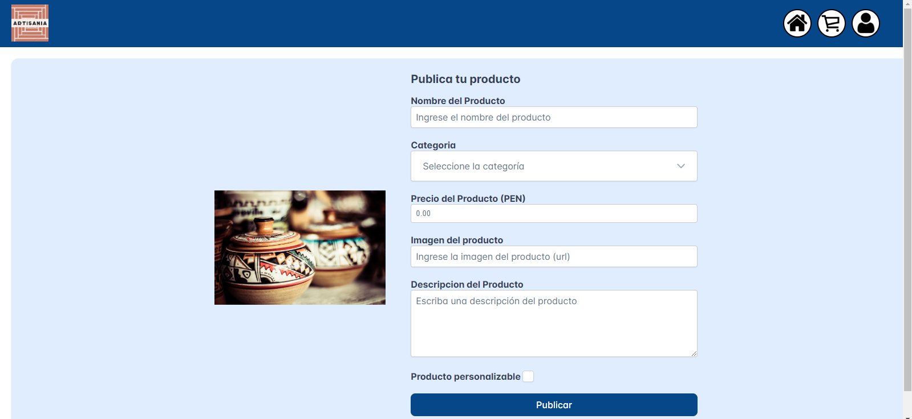

# **Tabla de Contenido**

- [Registro de Versiones](#registro-de-versiones)
- [Project Report Collaboration Insights](#project-report-collaboration-insights)
- [Student Outcome](#student-outcome)
- [Capítulo I: Introducción](#Capítulo-I-Introducción)
  - [1.1. Startup Profile](#11-startup-profile)
    - [1.1.1. Descripción de la Startup](#111-descripción-de-la-startup)
    - [1.1.2. Perfiles de integrantes del equipo](#112-perfiles-de-integrantes-del-equipo)
  - [1.2. Solution Profile](#12-solution-profile)
    - [1.2.1. Antecedentes y problemática](#121-antecedentes-y-problemática)
    - [1.2.2. Lean UX Process](#122-lean-ux-process)
      - [1.2.2.1. Lean UX Problem Statements](#1221-lean-ux-problem-statements)
      - [1.2.2.2. Lean UX Assumptions](#1222-lean-ux-assumptions)
      - [1.2.2.3. Lean UX Hypothesis Statements](#1223-lean-ux-hypothesis-statements)
      - [1.2.2.4. Lean UX Canvas](#1224-lean-ux-canvas)
  - [1.3. Segmentos objetivo](#13-segmentos-objetivo)
- [Capítulo II: Requirements Elicitation & Analysis](#Capítulo-II-Requirements-Elicitation--Analysis)
  - [2.1. Competidores](#21-competidores)
    - [2.1.1. Análisis competitivo](#211-análisis-competitivo)
    - [2.1.2. Estrategias y tácticas frente a competidores](#212-estrategias-y-tácticas-frente-a-competidores)
  - [2.2. Entrevistas](#22-entrevistas)
    - [2.2.1. Diseño de entrevistas](#221-diseño-de-entrevistas)
    - [2.2.2. Registro de entrevistas](#222-registro-de-entrevistas)
    - [2.2.3. Análisis de entrevistas](#223-análisis-de-entrevistas)
  - [2.3. Needfinding](#23-needfinding)
    - [2.3.1. User Personas](#231-user-personas)
    - [2.3.2. User Task Matrix](#232-user-task-matrix)
    - [2.3.3. User Journey Mapping](#233-user-journey-mapping)
    - [2.3.4. Empathy Mapping](#234-empathy-mapping)
    - [2.3.5. As-is Scenario Mapping](#235-as-is-scenario-mapping)
  - [2.4. Ubiquitous Language](#23-ubiquitous-language)
- [Capítulo III: Requirements Specification](#Capítulo-III-Requirements-Specification)
  - [3.1. To-Be Scenario Mapping](#31-to-be-scenario-mapping)
  - [3.2. User Stories](#32-user-stories)
  - [3.3. Impact Mapping](#33-impact-mapping)
  - [3.4. Product Backlog](#34-product-backlog)
- [Capítulo IV: Product Design](#Capítulo-IV-Product-Design)
  - [4.1. Style Guidelines](#41-style-guidelines)
    - [4.1.1. General Style Guidelines](#411-general-style-guidelines)
    - [4.1.2. Web Style Guidelines](#412-web-style-guidelines)
  - [4.2. Information Architecture](#42-information-architecture)
    - [4.2.1. Organization Systems](#421-organization-systems)
    - [4.2.2. Labeling Systems](#422-labeling-systems)
    - [4.2.3. SEO Tags and Meta Tags](#423-seo-tags-and-meta-tags)
    - [4.2.4. Searching Systems](#424-searching-systems)
    - [4.2.5. Navigation Systems](#425-navigation-systems)
  - [4.3. Landing Page UI Design](#43-landing-page-ui-design)
    - [4.3.1. Landing Page Wireframe](#431-landing-page-wireframe)
    - [4.3.2. Landing Page Mock-up](#432-landing-page-mock-up)
  - [4.4. Web Applications UX/UI Design](#44-web-applications-uxui-design)
    - [4.4.1. Web Applications Wireframes](#441-web-applications-wireframes)
    - [4.4.2. Web Applications Wireflow Diagrams](#442-web-applications-wireflow-diagrams)
    - [4.4.3. Web Applications Mock-ups](#443-web-applications-mock-ups)
    - [4.4.4. Web Applications User Flow Diagrams](#444-web-applications-user-flow-diagrams)
  - [4.5. Web Applications Prototyping](#45-web-applications-prototyping)
  - [4.6. Domain-Driven Software Architecture](#46-domain-driven-software-architecture)
    - [4.6.1. Software Architecture Context Diagram](#461-software-architecture-context-diagram)
    - [4.6.2. Software Architecture Container Diagrams](#462-software-architecture-container-diagrams)
    - [4.6.3. Software Architecture Components Diagrams](#463-software-architecture-components-diagrams)
  - [4.7. Software Object-Oriented Design](#47-software-object-oriented-design)
    - [4.7.1. Class Diagrams](#471-class-diagrams)
    - [4.7.2. Class Dictionary](#472-class-dictionary)
  - [4.8. Database Design](#48-database-design)
    - [4.8.1. Database Diagram](#481-database-diagram)
- [Capítulo V: Product Implementation, Validation & Deployment](#Capítulo-V-Product-Implementation-Validation--Deployment)
  - [5.1. Software Configuration Management](#51-software-configuration-management)
    - [5.1.1. Software Development Environment Configuration](#511-software-development-environment-configuration)
    - [5.1.2. Source Code Management](#512-source-code-management)
    - [5.1.3. Source Code Style Guide & Conventions](#513-source-code-style-guide--conventions)
    - [5.1.4. Software Deployment Configuration](#514-software-deployment-configuration)
  - [5.2. Landing Page, Services & Applications Implementation](#52-landing-page-services--applications-implementation)
    - [5.2.1. Sprint n](#521-sprint-n)
      - [5.2.1.1. Sprint Planning n](#5211-sprint-planning-n) -[5.2.1.2. Sprint Backlog n](#5212-sprint-backlog-n)
      - [5.2.1.3. Development Evidence for Sprint Review](#5213-development-evidence-for-sprint-review)
      - [5.2.1.4. Testing Suite Evidence for Sprint Review](#5214-testing-suite-evidence-for-sprint-review)
      - [5.2.1.5. Execution Evidence for Sprint Review](#5215-execution-evidence-for-sprint-review)
      - [5.2.1.6. Services Documentation Evidence for Sprint Review](#5216-services-documentation-evidence-for-sprint-review)
      - [5.2.1.7. Software Deployment Evidence for Sprint Review](#5217-software-deployment-evidence-for-sprint-review)
      - [5.2.1.8. Team Collaboration Insights during Sprint](#5218-team-collaboration-insights-during-sprint)
  - [5.3. Validation Interviews](#53-validation-interviews)
    - [5.3.1. Diseño de Entrevistas](#531-diseño-de-entrevistas)
    - [5.3.2. Registro de Entrevistas](#532-registro-de-entrevistas)
    - [5.3.3. Evaluaciones según heurísticas](#533-evaluaciones-según-heurísticas)
  - [5.4. Video About-the-Product](#54-video-about-the-product)
- [CONCLUSIONES](#CONCLUSIONES)
- [BIBLIOGRAFIA](#BIBLIOGRAFIA)
- [ANEXOS](#ANEXOS)
- 
<h1>Project Report Collaboration Insights</h1>

<strong>URL de la organizacion de github: </strong>https://github.com/WX53-Grupo-1-Aplicaciones-Web

Presentamos los analíticos de colaboracion y los gráficos de commits realizados durante la elaboracion del proyecto. Debido a un cambio de repositorios del proyecto a los repositorios de la organizacion, la colaboracion de algunos miembros podría no verse reflejada, sin embargo afirmamos que todos los miembros del equipo trabajaron conjuntamente. 

Para la elaboración del proyecto programamos reuniones semanales para acordar, repartir partes del informe y revisar avances del proyecto en general de forma puntual.

<h1>REGISTRO DE VERSIONES</h1>
<table>
    <tr>
        <th>Version</th>
        <th>Fecha</th>
        <th>Autor</th>
        <th>Descripcion de modificacion</th>
    </tr>
    <tr>
        <td>1.1</td>
        <td>22/03/2024</td>
        <td>Nicolas Andres Cortes Hidalgo</td>
        <td>Inicio capitulo 1</td>
    </tr>
    <tr>
        <td>1.2</td>
        <td>25/03/2024</td>
        <td>Anderson Walter Macedo Calsina</td>
        <td>Avance capitulo 1 entrevistas</td>
    </tr>
    <tr>
        <td>1.3</td>
        <td>26/03/2024</td>
        <td>Santos Alexis Patazca Calderón</td>
        <td>Registro de entrevistas</td>
    </tr>
    <tr>
        <td>1.4</td>
        <td>01/04/2024</td>
        <td>Franz Jair La Torre Valle</td>
        <td>Inicio del capitulo 2</td>
    </tr>
    <tr>
        <td>1.5</td>
        <td>02/04/2024</td>
        <td>Alessandro Joaquin Bernardo Eusebio</td>
        <td>Needfinding</td>
    </tr>
    <tr>
        <td>1.6</td>
        <td>03/04/2024</td>
        <td>Nicolas Andres Cortes Hidalgo</td>
        <td>Creacion del capiutlo 3</td>
    </tr>
    <tr>
        <td>1.7</td>
        <td>05/04/2024</td>
        <td>Anderson Walter Macedo Calsina</td>
        <td>User stories</td>
    </tr>
    <tr>
        <td>1.8</td>
        <td>02/04/2024</td>
        <td>Santos Alexis Patazca Calderón</td>
        <td>Creacion del capitulo 4</td>
    </tr>
    <tr>
        <td>1.9</td>
        <td>07/05/2024</td>
        <td>Franz Jair La Torre Valle</td>
        <td>Confirmacion de estilos</td>
    </tr>
    <tr>
        <td>2.0</td>
        <td>8/04/2024</td>
        <td>Santos Alexis Patazca Calderón</td>
        <td>Wireframes y mock ups de la aplicacion web</td>
    </tr>
    <tr>
        <td>2.1</td>
        <td>10/04/2024</td>
        <td>Alessandro Joaquin Bernardo Eusebio</td>
        <td>Creacion del landing page</td>
    </tr>
  <tr>
        <td>3.0</td>
        <td>17/04/2024</td>
        <td>Alessandro Joaquin Bernardo Eusebio</td>
        <td>Creacion del login</td>
    </tr>
  <tr>
        <td>3.1</td>
        <td>18/04/2024</td>
        <td>Santos Alexis Patazca Calderón</td>
        <td>Creacion del registro de usuarios</td>
    </tr>
  <tr>
        <td>3.2</td>
        <td>10/04/2024</td>
        <td>Anderson Walter Macedo Calsina</td>
        <td>Creacion de la sección de actualización de contraseña/td>
    </tr>
  <tr>
        <td>3.3</td>
        <td>10/04/2024</td>
        <td>Nicolas Andres Cortes Hidalgo</td>
        <td>Creacion del Catálogo</td>
    </tr>
  <tr>
        <td>3.4</td>
        <td>10/04/2024</td>
        <td>Franz Jair La Torre Valle</td>
        <td>Creacion del landing page</td>
    </tr>
  <tr>
        <td>3.5</td>
        <td>10/04/2024</td>
        <td>Alessandro Joaquin Bernardo Eusebio</td>
        <td>Creacion de la informacion del perfil/td>
    </tr>
  <tr>
        <td>3.6</td>
        <td>10/04/2024</td>
        <td>Santos Alexis Patazca Calderón</td>
        <td>Creacion de la edición del perfil</td>
    </tr>
  <tr>
        <td>3.7</td>
        <td>10/04/2024</td>
        <td>Anderson Walter Macedo Calsina</td>
        <td>Creacion del detalle del producto</td>
    </tr>
  <tr>
        <td>3.8</td>
        <td>10/04/2024</td>
        <td>Nicolas Andres Cortes Hidalgo</td>
        <td>Creacion de la publicacion del producto</td>
    </tr>
    <tr>
        <td>3.9</td>
        <td>10/04/2024</td>
        <td>Franz Jair La Torre Valle</td>
        <td>Creacion de la sección de compra</td>
    </tr>
    <tr>
        <td>3.11</td>
        <td>10/04/2024</td>
        <td>Alessandro Joaquin Bernardo Eusebio</td>
        <td>Creacion de la vista de parametros de personalizacion</td>
    </tr>
    <tr>
        <td>3.12</td>
        <td>10/04/2024</td>
        <td>Santos Alexis Patazca Calderón</td>
        <td>Creacion del acuerdo de adquisición</td>
    </tr>
  
</table>

<h1>STUDENT OUTCOME</h1>
<table>
    <tr>
        <th>Criterio Específico</th>
        <th>Acciones realizadas</th>
        <th>Conclusiones</th>
    </tr>
    <tr>
        <td><strong>Student Outcome 5:</strong> La capacidad de funcionar efectivamente en un
equipo cuyos miembros juntos proporcionan liderazgo, crean un entorno de
colaboración e inclusivo, establecen objetivos, planifican tareas y cumplen objetivos.</td>
        <td><strong>TB1:</strong>
            
<strong>Alessandro Joaquin Bernardo Eusebio.-</strong> Propuse la idea de la startup como punto de partida para la investigación de mercado y la elaboración del needfinding en la fase inicial del proyecto. También participé en la creación de los repositorios necesarios, colaboré en la realización del informe y contribuí en la elaboración del landing page, así como en la creación de los wireframes y mockups correspondientes, incluyendo los flujos de navegación.

            
<strong>Nicolas Andres Cortes Hidalgo.-</strong> Me encargue de lo que es la creacion de todo el Lean UX Process, ademas de la creacion del User Task Matrix y el Product Backlog. Contribui en uno de los videos del apartado de la realizacion de entrevistas. Por ultimo, hice modificaciones en el informe de acuerdo a los avanzes que he ido realizando de los apartados que se me fueron asignados.

            
<strong>Anderson Walter Macedo Calsina.-</strong> Me encargue de elaborar los Hypothesis Statements para validar los supuestos planteados anteriormente. Ademas elabore las estrategias y tácticas frente a competidores para lograr los objetivos que hemos planteados.

            
<strong>Santos Patazca Calderón.-</strong> Realice los antecedentes y problemáticas, para poder tener mas claro nuestra idea de startup, también aporte con la elaboración del diseño de entrevista y la entrevista de un segmento. También con la elaboración de los As-is y To-be Scenario Mapping. He aportado en el desarollo del landing page con lo que se me asignó de nuestro proyecto. Por ultimo, con la elaborción del sprint 1.

            
<strong>Franz Jair La Torre Valle.-</strong> Colaboré en la idea del startup para iniciar el proyecto, desarrollé los segmentos objetivos y su división para una correcta comprensión. Además, adjunté mi entrevista y creé los respectivos user personas y user journey mapping para ambos segmentos. También contribuí con los wireframes y mockups asignados, así como en el desarrollo posterior del landing page de mi sección.

         <strong>TB2:</strong>
      
<strong>Alessandro Joaquin Bernardo Eusebio.-</strong> La elaboración de este proyecto en Vue fue una experiencia gratificante y desafiante. Contribuir al desarrollo del flujo de creación de perfil, inicio de sesión y creación de cuenta fue crucial para establecer una experiencia de usuario fluida desde el principio. Además, participar en la creación del catálogo de productos y la personalización de productos nos permitió ofrecer a los usuarios una amplia gama de opciones. El proceso de compra de productos fue especialmente satisfactorio de implementar, ya que pudimos integrar de manera efectiva diferentes funcionalidades para garantizar una experiencia de compra sin problemas.

            
<strong>Nicolas Andres Cortes Hidalgo.-</strong> La elaboración de este proyecto en Vue fue una oportunidad emocionante para aplicar nuestros conocimientos en el desarrollo web. Trabajar en la implementación del cambio de contraseña y en la gestión del flujo de inicio de sesión fue fundamental para garantizar la seguridad y la comodidad de nuestros usuarios. Además, participar en la creación del catálogo de productos y la publicación de productos nos permitió mostrar eficazmente nuestra oferta a los usuarios. La integración de estas funcionalidades en un flujo cohesivo de compra de productos demostró nuestra capacidad para crear una experiencia de usuario integral.

            
<strong>Anderson Walter Macedo Calsina.-</strong> Participar en la elaboración de este proyecto en Vue fue una experiencia enriquecedora que me permitió aplicar estrategias efectivas para lograr nuestros objetivos. Contribuir al desarrollo de la personalización de productos y al proceso de compra de productos fue especialmente gratificante, ya que pude trabajar en la implementación de soluciones innovadoras para satisfacer las necesidades de nuestros usuarios. Además, trabajar en la estrategia de competidores y en la validación de hipótesis me permitió entender mejor el mercado y adaptar nuestras funcionalidades de acuerdo a ello.

            
<strong>Santos Patazca Calderón.-</strong> La elaboración de este proyecto en Vue fue un desafío emocionante que me permitió contribuir a diferentes aspectos clave del desarrollo. Trabajar en la elaboración del flujo de creación de perfil, el catálogo de productos y la personalización de productos fue especialmente gratificante, ya que pude aplicar mis habilidades de diseño y desarrollo para crear una experiencia de usuario atractiva y funcional. Además, participar en la implementación del cambio de contraseña y en la gestión del inicio de sesión fue fundamental para garantizar la seguridad y la comodidad de nuestros usuarios durante todo el proceso.

            
<strong>Franz Jair La Torre Valle.-</strong> Participar en la elaboración de este proyecto en Vue fue una experiencia estimulante que me permitió contribuir al desarrollo de funcionalidades clave. Trabajar en la creación del catálogo de productos, la publicación de productos y la personalización de productos fue especialmente gratificante, ya que pude aplicar mi creatividad y experiencia en diseño para ofrecer una experiencia de usuario atractiva y personalizada. Además, participar en la integración de estas funcionalidades en un flujo de compra de productos cohesivo demostró nuestra capacidad para crear una experiencia de usuario integral y satisfactoria.

        <td> <ul>
          <li>Como equipo hemos realizado un trabajo de forma colaborativa y comunicativa, siempre asistiendo a nuestras reuniones y lograr coordinar para poder tener un proyecto eficiente.</li>
          <li>Como equipo, hemos trabajado de manera colaborativa y comunicativa para desarrollar los flujos de diseño correspondientes al frontend de nuestro marketplace de productos artesanales. Además, hemos utilizado APIs simuladas para realizar operaciones CRUD (Create, Read, Update, Delete) y validar la funcionalidad del sistema. Nuestra constante asistencia a las reuniones y nuestra capacidad para coordinarnos han sido esenciales para garantizar la eficiencia del proyecto.</td></li>
        </ul>
        </td>
    </tr>
</table>
<h1>CAPÍTULO I: INTRODUCCIÓN</h1>

<h2>1.1 Startup Profile</h2>
<h3>1.1.1 Descripción de la Startup</h3>

Artisanía es un marketplace único que reúne una amplia variedad de productos artesanales de alta calidad, 
junto con la posibilidad de personalizar ciertos artículos para satisfacer las necesidades individuales de nuestros 
clientes. Nos esforzamos por ofrecer una plataforma integral donde los amantes de la artesanía pueden descubrir, 
explorar y adquirir productos excepcionales de artesanos talentosos de todo el mundo. Además de proporcionar una 
experiencia de compra tradicional, también ofrecemos la opción de personalización, lo que permite a nuestros 
clientes colaborar directamente con los artesanos para crear piezas verdaderamente únicas y significativas.

<strong>Nuestra misión</strong> es democratizar el acceso a productos artesanales de calidad mientras celebramos la individualidad 
y la creatividad. Nos comprometemos a brindar a nuestros clientes una experiencia de compra en línea sin igual, 
donde puedan descubrir productos auténticos y también participar en el proceso creativo a través de la 
personalización. Al hacerlo, apoyamos a artesanos locales y promovemos la preservación de las habilidades 
artesanales tradicionales en un entorno moderno y globalizado.

<strong>Nuestra visión</strong> es establecer un estándar de excelencia en la industria del comercio electrónico, 
donde la personalización y la artesanía se fusionen de manera armoniosa con la conveniencia y la accesibilidad. 
Aspiramos a ser el destino preferido para aquellos que buscan productos únicos y personalizados, tanto para uso 
personal como para regalos especiales. A medida que crecemos, nos comprometemos a seguir innovando y mejorando 
nuestra plataforma para satisfacer las necesidades cambiantes de nuestros clientes y para seguir siendo líderes 
en la integración de la tecnología y la artesanía en el mercado en línea.

<h3>1.1.2 Perfiles de integrantes del equipo</h3>
| Fotos   | Descripción   | 

<strong>Santos Alexis Patazca Calderón</strong>

  Soy estudiante de la carrera de Ingeniería de Software. Soy una persona responsable y soy respetuoso con mis compañeros de equipo, tengo buena comunicación con mis compañeros, me gusta seguir aprendiendo diversos lenguajes de programación para poder amplicar mis conocimientos. Tengo grandes expectativas en este curso y poder seguir aprendiendo. 

<strong>Alessandro Joaquin Bernardo Eusebio</strong>

Soy estudiante de la carrera de Ingeniería de software en la UPC, tengo conocimientos básicos sobre programación
 en el lenguaje de C++ y Python, conocimiento básico sobre configuración de redes y aplicación de la complejidad 
algorítmica. Tengo además conocimientos básicos sobre ciberseguridad y fundamentos de probabilidad y sus aplicaciones
. Siempre dispuesto a trabajar en equipo. Me considero una persona paciente y respetuosa que tiene como objetivo 
llevar a cabo este proyecto de forma satisfactoria.

<strong>Nicolas Andres Cortes Hidalgo</strong>

Soy un estudiante de la carrera de Ingenieria de Software en la UPC, tengo 20 años y curso actualmente el septimo 
 ciclo de la carrera. Me considero una persona responsable y activa en lo que respecta a todo tipo de trabajos. 
 Tengo conocimientos avanzados en Office y C++ e intermedios en Python y SQL. Mi objetivo dentro del curso es aprender 
 todo lo posible para poder emplear todos los conocimientos que adquiera en el futuro.

 
<strong>Franz Jair La Torre Valle</strong>

Soy estudiante de la carrera de Ingeniería de Software en la Universidad Peruana de Ciencias Aplicadas.
En mis tiempos libres me gusta leer, ver películas, practicar deportes y experimentar con nuevas actividades.
Mi compromiso con el equipo es siempre ser participativo, estar al pendiente de las actividades, responder cualquier duda y aportar en lo que se pueda. 

<strong>Anderson Walter Macedo Calsina</strong>

Soy Anderson Walter Macedo Calsina, estudiante de la carrera de ing de software. Me gusta ayudar a los demás y colaborar para un trabajo en conjunto. Estoy dispuesto a esforzarme y estar comprometido en mis cursos y actividades designadas, orientando las soluciones a las diversas propuestas.

<h2>1.2 Solution Profilee</h2>
<h3>1.2.1 Antecedentes y problemática</h3>
<h4>1.2.1.1. What?</h4>

La problemática que tiene nuestro startup se centra en los artesanos peruanos que no se encuentran registrados y no pueden tener oportunidades para dar visibilidad a su negocio, si bien no representa un gran porcentaje en la producción nacional, pues cada artesano cuenta con historia de familias que van enseñando de generación en generación y su economía depende de esta labor.

<h4>1.2.1.2. When?</h4>

El estado ha ido apoyando a los artesanales, pero el problema aun persiste y existe un porcentaje de artesanales que se encuentran en situación de informalidad y por ende su economía no crece. Es por eso por lo que nuestra plataforma puede apoyar para que tengan mayores opciones de compra.

<h4>1.2.1.3. Where?</h4>

Nuestros usuarios podrán utilizar la plataforma que dispongan de acceso a internet. Está dirigido a los artesanos y turistas que les apasione la creatividad. 

<h4>1.2.1.4. Who?</h4>

Los involucrados en el problema son todos aquellos artesanos y turistas que desean utilizar una plataforma digital de una forma sencilla y segura para poder llevar a cabo sus pagos.

<h4>1.2.1.5. Why?</h4>

Se desarrolla el startup como respuesta de la necesidad de los artesanos que puedan ampliar el alcance de sus productos y poder vender sus productos. Asimismo, los clientes podrán visualizar nuevos productos y poder brindarles una nueva alternativa.

<h4>1.2.1.6. How?</h4>

La plataforma permitirá que los artesanos puedan compartir sus trabajos y podrán personalizar de acuerdo con el cliente. Se podrán registrar como artesanos y clientes, podrán disfrutar todos los beneficios que brindamos. 

<h4>1.2.1.7. How much?</h4>

Según COMEXPERU, el RNA se encuentran registrados 61 763 personas artesanales, el 62.6% no cuenta con RUC y esto afectaría a su negocio ya que no podrían participar en eventos y poder formalizar sus negocios y perderían muchas oportunidades

<h4>Antecedentes</h4>

Muchos artesanos se encuentran la informalidad y no pueden dar a conocer sus trabajos, algunos turistas tienen dificultades para poder ver una gran variedad de artesanos de diferentes lugares del país, esto puede ser por su forma de acceso. 

<h4>Problemática a resolver</h4>

Con todo lo propuesto, existe una necesidad de que exista una mejor forma de poder dar mayor visibilidad a los artesanos y poder brindarles un servicio que les sea accesibles y factibles, también brindaría un beneficio a muchos clientes que les gustaría poder realizar una compra segura. Asimismo, es necesario brindar nuevas formas de pago y poder usar la tecnología que les sea atractivo.

<h3>1.2.2. Lean UX Process</h3>
<h4>1.2.2.1 Lean UX Problem Statements</h4>
<h4>Comerciantes de Artesanias</h4>

El principal problema de los comerciantes de artesanías es que la gran mayoría de ellos se encuentran en la informalidad, a la vez que estos se suelen encontrar en centros especializados a la venta de las artesanías, esto provoca que una persona deba ir hasta el mismo lugar para encontrar una artesanía que le pueda gustar, sin contar además que los centros anteriormente mencionados no son muy abundantes en Lima, por lo que la distancia entre la persona interesada y el lugar en cuestión suele desmotivar a la persona.

Luego de haber entendido esto ¿Como podemos ayudar a los comerciantes a que estos tengan un mayor alcance para ofrecer sus productos al público en general?

<h4>Elaboradores de Artesanias</h4>

El problema de los comerciantes afecta también a los artesanos en cuestión, sin embargo, estos sufren un problema mayor.
Los artesanos elaboran sus artesanías con conceptos que ellos mismos conciben o bien tomando ideas de otros artesanos y adaptándolos a su estilo ¿Por qué esto es un problema? Porque esto provoca que el producto final va acorde a lo que el artesano quiso concebir, lo que provoca que quizás la artesanía no sea del agrado del consumidor, pues todos tenemos gustos diferentes.

Al haber explicado esto ¿Como podemos ayudar a que el artesano tenga a su disposición artesanías que sean del agrado de sus clientes?

<h4>1.2.2.2 Lean UX Assumptions</h4>
<h4>Business Outcomes</h4>

Creemos que lao artesanos y comerciantes de las artesanías necesitan una forma eficiente no solo de vender sus productos, sino de promocionarlos, ya que sus negocios en si representan una parte de la cultura de nuestro país pues toda artesanía representa a una cultura en cuestión de nuestro país, además de que una gran cantidad de artesanos y comerciantes dependen de la venta de las artesanías para lograr sustentarse tanto a ellos mismos como a sus familias.

Pensamos que las personas interesadas en artesanías de cualquier tipo verían con buenos ojos una manera más rápida y sencilla de poder encontrar algún tipo de artesanía que sea de su agrado.

Estimamos que el cliente, además de poder visualizar una gran cantidad de artesanías desde su hogar, también tendrá el beneficio de poder contactar con el artesano en cuestión para poder plasmar una idea que tenga el cliente en una artesanía creada por el artesano.

<h4>Users</h4>

Nosotros asumimos que nuestros principales usuarios serán los siguientes:

-Artesanos independientes que deseen que sus artesanías tengan un mayor alcance para así poder aumentar sus ganancias mensuales.

-Comerciantes de artesanías que posean acuerdos con artesanos para vender sus productos.

-Coleccionistas de artesanías y/o personas interesadas en las mismas las cuales buscan una forma más sencilla de encontrar productos artesanales.

<h4>User Outcomes</h4>

Lo que el usuario quiere lograr al utilizar nuestro servicio es:

<h4>Comerciantes y artesanos</h4>

-Incrementar el alcance de los productos ofrecidos.

-Incrementar el número de clientes que reciben mensualmente.

-Fabricar productos más atractivos para su público para así asegurar ventas de forma más efectiva.

<h4>Compradores de artesanías</h4>

-Tener un sistema más efectivo para comprar artesanías.

-Poder adquirir artesanías que se adapten más fácilmente a sus gustos.

<h4>Features</h4>

 Lo que busca la plataforma en cuestion es satisfacer las necesidades de nuestros segmentos ofrecidos, por lo que estas son las caracteristicas que se han incluido basandonos en nuestros usuarios

<h4>Artesanos</h4>

-Carga, subida y edicion de imagenes para poder mostrar de la mejor forma posible el producto ofrecido.

-Plataforma de contacto con los clientes para poder ofrecerles detalles tanto del producto como del precio del mismo.

<h4>Cliente</h4>

-Interfaz facil de navegar para poder encontrar la artesania deseada.

-Plataforma de contacto con los artesanos para poder crear una artesania que el cliente no encuentre dentro del sitio.

<h4>1.2.2.3 Lean UX Hypothesis Statements</h4>

En esta sección validamos los supuestos planteados anteriormente con la intención de afianzar la idea y los conocimientos sobre nuestros segmentos. A continuación, mostraremos hipótesis realizadas por cada usuario.

<h4>Artesanos:</h4>

- Creemos que implementando una función que permita cargar, subir y editar imágenes de productos de manera sencilla, entonces los artesanos podrán mostrar sus productos de forma más atractiva, lo que podría aumentar el interés de los clientes y las ventas.

- Creemos que brindar una plataforma de contacto directo con los clientes, permitiendo ofrecer detalles específicos sobre los productos y sus precios, entonces los artesanos podrán establecer una comunicación más efectiva con los clientes, lo que podría conducir a un aumento en las conversiones y en la satisfacción del cliente.

<h4>Clientes:</h4>

- Creemos que si creamos una interfaz de usuario fácil de navegar, que permita a los clientes encontrar rápidamente las artesanías deseadas, entonces los clientes estarán más inclinados a explorar y realizar compras en la plataforma, lo que podría aumentar la retención de usuarios y las tasas de conversión.

- Creemos que facilitar el contacto directo con los artesanos, permitiendo a los clientes solicitar artesanías personalizadas que no estén disponibles en el sitio, entonces aumentará la satisfacción del cliente al ofrecer una experiencia de compra más personalizada y exclusiva. Esto podría llevar a un aumento en las ventas y en la fidelidad del cliente.

<h4>1.2.2.4 Lean UX Canvas</h4>

<h2>1.3 Segmentos objetivo</h2>

Nuestra aplicación está dirigida a dos segmentos objetivos los cuales son:

<h4>- Cliente:</h4>

Aquellos amantes de la artesanía que buscan productos únicos y auténticos, así como aquellos en busca de regalos personalizados que reflejen su aprecio por la creatividad y la artesanía tradicional.

<h4>- Artesano:</h4>

Aquellos artesanos independientes y pequeñas empresas creativas que buscan expandir su alcance y conectar con una audiencia global a través de una plataforma que valora la calidad y la individualidad de sus creaciones.

<h1>CAPÍTULO II: REQUIREMENTS ELICITATION & ANALYSIS</h1>

<h2>2.1 Competidores</h2>
<h3>2.1.1 Análisis competitivo</h3>

<table>
  <tr>
    <th></th>
    <th>Artesanum 
</th>
    <th>ArtePeru </th>
    <th>Mercado Libre </th>
  </tr>
  <tr>
    <td><strong>Overview</strong></td>
    <td>Plataforma en línea que conecta a artesanos y diseñadores peruanos con clientes interesados en productos hechos a mano.</td>
    <td>Marketplace dedicado a la venta de productos artesanales peruanos, directamente de artesanos locales.	</td>
    <td>Plataforma en línea que ofrece una amplia gama de productos, incluyendo algunos artículos artesanales, aunque no es exclusivamente para este tipo de productos.	</td>
  </tr>
  <tr>
    <td><strong>Ventajas Competitivas</strong></td>
    <td>Enfoque exclusivo en productos artesanales peruanos. Mayor visibilidad para los artesanos locales.	</td>
    <td>Promoción y venta exclusiva de productos artesanales peruanos. Apoyo directo a la comunidad artesanal.	</td>
    <td>Amplia audiencia y reconocimiento internacional. Posibilidad de llegar a un gran número de clientes.	</td>
  </tr>
  <tr>
    <td><strong>Mercado Objetivo</strong></td>
    <td>Consumidores locales e internacionales interesados en productos artesanales peruanos.	</td>
    <td>Consumidores locales e internacionales que buscan productos artesanales auténticos de Perú.	</td>
    <td>Diversos segmentos de mercado tanto local como internacional, con énfasis en compradores en línea.	</td>
  </tr>
  <tr>
    <td><strong>Estrategias de Marketing</strong></td>
    <td>Promoción de la autenticidad y calidad de los productos artesanales peruanos. Colaboraciones con influencers y promoción en redes sociales.	</td>
    <td>Enfoque en la promoción de la cultura y la tradición peruana a través de productos artesanales. Campañas de marketing digital dirigidas a consumidores interesados en artesanía.	</td>
    <td>Publicidad en línea dirigida a diferentes segmentos de mercado. Promoción de productos artesanales como alternativas únicas y auténticas.	</td>
  </tr>
  <tr>
    <td><strong>Productos & Servicios</strong></td>
    <td>PAmplia variedad de productos artesanales peruanos, incluyendo textiles, cerámica, joyería, y decoración.	</td>
    <td>Productos artesanales peruanos que abarcan textiles, cerámica, joyería, y más.	</td>
    <td>Diversidad de productos, incluyendo algunos artículos artesanales peruanos entre una amplia gama de categorías.	</td>
  </tr>
  <tr>
    <td><strong>Precios & Costos</strong></td>
    <td>Precios variados según la artesanía y la calidad. Costos de producción pueden ser relativamente bajos para los artesanos.	</td>
    <td>Precios competitivos basados en el valor artesanal y la autenticidad. Costos de producción pueden influir en los precios finales.	</td>
    <td>Precios competitivos con una amplia gama de productos disponibles. Los costos de producción pueden variar dependiendo del tipo de producto.	</td>
  </tr>
  <tr>
    <td><strong>Canales de Distribución</strong></td>
    <td>Venta exclusiva en línea a través de la plataforma Artesanum Perú. Envío nacional e internacional disponible.	</td>
    <td>Venta en línea a través del sitio web de ArtePerú. Envío nacional e internacional disponible.	</td>
    <td>Principalmente venta en línea a través del sitio web de MercadoLibre Perú. Posibilidad de envío nacional e internacional.	</td>
  </tr>
  <tr>
    <td><strong>Fortalezas</strong></td>
    <td>Conexión directa entre artesanos y clientes. Promoción de la cultura peruana a través de productos artesanales.	</td>
    <td>Fomento de la artesanía peruana y apoyo directo a los artesanos locales. Enfoque exclusivo en productos auténticos de Perú.	</td>
    <td>Amplia audiencia y reconocimiento de marca. Infraestructura establecida para ventas en línea.	</td>
  </tr>
  <tr>
    <td><strong>Debilidades</strong></td>
    <td>Dependencia de la plataforma para la visibilidad y ventas. Competencia con otros marketplaces.	</td>
    <td>Limitación de alcance en comparación con marketplaces más grandes. Dependencia de la plataforma para la visibilidad y ventas.	</td>
    <td>Competencia con otros vendedores y productos en la plataforma. Dependencia de la plataforma para la visibilidad y ventas.			</td>
  </tr>
  <tr>
    <td><strong>Oportunidades</strong></td>
    <td>Crecimiento del comercio electrónico en Perú y el interés creciente en productos artesanales. Mayor acceso a mercados internacionales.	</td>
    <td>Potencial para colaboraciones con empresas o instituciones para promover la artesanía peruana. Crecimiento del turismo y el interés en la cultura peruana.	</td>
    <td>Crecimiento del comercio electrónico en Perú. Oportunidades de expansión a través de asociaciones con marcas locales.		</td>
  </tr>
 <tr>
    <td><strong>Amenazas</strong></td>
    <td>Cambios en las tendencias de consumo o en la economía que puedan afectar la demanda de productos artesanales. Competencia con productos masivos y fabricados en masa.</td>
    <td>Competencia con otras plataformas de venta en línea y productos importados.</td>
    <td>Cambios en las políticas de la plataforma que puedan afectar la visibilidad o la facilidad de venta para los artesanos.</td>
  </tr>
</table>
<h3>2.1.2 Estrategias y tácticas frente a competidores</h3>

- Nos centraremos en crear una app dirigida a los artesanos y amantes de productos artesanales, en el cual podran descubrir, explorar y adquirir dichos productos, con el objetivo de ser la principal aplicacion de artesania del mercado en línea.

- Ofreceremos características únicas en la plataforma que sean valoradas por los usuarios, como una interfaz más intuitiva o un sistema de contacto con funciones adicionales.

- Priorizar la experiencia del usuario en la plataforma, asegurándose de que sea fácil de navegar tanto para artesanos como para clientes.

<h2>2.2 Entrevistas</h2>
<h3>2.2.1 Diseño de entrevistas</h3>
<h4>Preguntas Generales</h4>

- ¿Cuál es su nombre completo y su edad?

- ¿A qué se dedica actualmente?

- ¿Cuáles son los dispositivos que utiliza principalmente?

- ¿Le es fácil adaptarse a sitios web o aplicativos móviles?

<h4>Artesanos</h4>

- ¿Cuántos años lleva dedicándose a la artesanía?

- ¿Cuáles son los medios donde promociona su artesanía?

- ¿Alguna vez ha vendido productos artesanales en alguna red social o plataforma?

Si fuera el caso 

- ¿Lo considera rentable? 

De lo contario

- ¿Qué te detiene al vender tus productos artesanales en línea?

- ¿Qué tipo de herramientas necesitarías para vender tus productos en línea de manera exitosa?

- ¿Qué características valorarías más al vender tus productos artesanales en línea?

- ¿Estás interesado en la posibilidad de personalizar productos para tus clientes?

- ¿Qué te motivaría unirte a una plataforma de marketplace de artesanías en línea?

<h4>Clientes</h4>

- ¿Con qué frecuencia compras productos artesanales?

- ¿Alguna vez realizó compras de productos artesanales en línea? ¿Qué tal fue su experiencia?

Si fuera el caso

- ¿Cómo se contactó con ellos? ¿Qué tal fue su experiencia?

De lo contrario

- ¿Tienes alguna preocupación en específico al comprar productos artesanales en línea?

- Cuando ve la información del producto en una plataforma digitales, ¿Considera que es suficiente para poder concretar la compra?

- ¿Considerarías la opción de personalización de productos artesanales importante al realizar una compra en línea?

-¿Qué características valorarías más en una plataforma de marketplace de artesanías?

- ¿Qué te gustaría ver en una plataforma de marketplace de artesanías?

- ¿Qué recomendación le darías a una persona que se dedica a la venta de artesanía para que pueda atraer clientes y se sientan seguros?

<h3>2.2.2 Registro de entrevistas</h3>
<h4>Cliente</h4>
<h4>Nombre: Nelson Maicol Guevara Oré</h4>

<strong>Link del video: </strong> https://drive.google.com/file/d/1IJhJeDnX3sVTXUSjfliCac4gZsyZghIE/view?usp=sharing

Nelson es universitario y también trabaja, los dispositivos que más utiliza son el celular y la laptop, él ha viajado y en ocasiones ha logrado comprar productos de artesanos, nos comenta que en una oportunidad logro comprar un collar en un lugar donde vendían a otros turistas. Nos cuenta que nunca realizó compras de productos de artesanía en páginas web porque le preocupa que la página no cuente con una seguridad eficaz para su compra, además teme que el producto sea distinto al que vio en la foto o llegue en malas condiciones. El considera que los productos en las páginas deben tener más información y fotos de diferentes ángulos del producto. Le gustaría que el producto de artesanía sea personalizable siente que sería un valor único. Comenta que una plataforma debe ser segura, intuitiva y amigable. Por último, la recomendación que les daría a los artesanos es que sea sinceros al vender su producto, que ofrezcan tal como se muestran en las imágenes y que sea de calidad.

<h4>Artesano</h4>
<h4>Nombre: Roy Romero Torres</h4>

<strong>Link del video: </strong> https://www.youtube.com/watch?v=CBFpRIXrUVo&ab_channel=AlessandroJoaquinBernardoEusebio

Roy Romero es un escultor dedicado que ha demostrado una fuerte dependencia de las ventas durante las temporadas turísticas o en ferias artesanales, sin embargo, su falta de adaptación a las tecnologías modernas se limita al uso de su celular, principalmente a través de WhatsApp para comunicarse con otros artesanos. A pesar de esto, muestra un interés en aprender y mejorar su presencia en línea, expresando su deseo de tener un marketplace diseñado específicamente para personas con necesidades similares a las suyas. 

<h4>Cliente</h4>
<h4>Nombre: Luis Bernardo Eusebio</h4>

<strong>Link del video: </strong> https://www.youtube.com/watch?v=fl4WpaItb6E&ab_channel=AlessandroJoaquinBernardoEusebio

Luis Francisco es un profesional de la carrera de derecho apasionado por viajar por el país, donde disfruta adquiriendo artesanías como recuerdos de sus travesías. Su preocupación principal radica en la calidad de los productos que adquiere, tanto en persona durante sus viajes como en línea. La posibilidad de comprar artesanías en línea le genera inquietud respecto a la calidad del producto recibido y su correspondencia con lo ofrecido en la publicidad. Sin embargo, está interesado en la idea de poder encargar productos personalizados mediante una comunicación directa con artesanos, permitiendo así una mayor seguridad en la calidad del producto final y una experiencia de compra más satisfactoria. 

<h4>Artesana</h4>
<h4>Nombre: Aleshka Fernandez</h4>

<strong>Link del video: </strong> https://youtu.be/epkIDnPpWUE

Aleshka Fernandez, estudiante de arte y diseño, se encuentra inmersa en su tesis colaborando con artesanos de la región Amazonas. Aunque ella encuentra fácil el uso de dispositivos, no todos los artesanos con los que interactúa tienen la misma facilidad, debido a diferencias generacionales o limitaciones de acceso en esas zonas. Los artesanos de Amazonas forman parte de la organización CITE Utcubamba, que utiliza su plataforma y redes sociales como medios, aunque esta estrategia no resulta tan rentable debido a limitaciones de alcance. Las ferias organizadas ocasionalmente resultan un poco más rentables, pero no son una solución diaria. Aleshka está a favor de la personalización de productos y considera esta idea como innovadora.

<h4></h4>
<h4>Nombre: Horacio Beraldo</h4>

<strong>Link del video: </strong> https://drive.google.com/file/d/1CkB0Xcq_ffSSS3H1r92ltidGMveA7wvQ/view?usp=sharing

Horacio Beraldo es un artesano de 26 años, que entro a este negocio por decision propia al haberse retirado su padre debido a la edad y su propia decision de querer continuar el legado de su familia, ya que se trata de un negocio familiar y que ha pasado por generaciones. Horacio tiene un puesto en un centro comercial dedicado a la venta de productos artesanales. Cuenta que tiene problemas a la hora de generar ingresos debido a que estos son totalmente dependientes del flujo de clientes que Horacio obtenga, por lo que, al ser estos productos no tan populares, no puede generar ganancias altas de forma constante. A pesar de no ser del todo joven, Horacio se siente bastante comodo con la utilizacion de dispositivos electronicos para la promocion de su negocio, ademas, considera que la personalizacion de productos segun necesidades de sus clientes le permitira crear productos que sean ventas seguras.

<h4>Cliente</h4>
<h4>Nombre: Andrea Joselyn Garcia Moscoso</h4>

<strong>Link del video: </strong> https://youtu.be/4RcdxQvFTBI

Andrea es una estudiante universitaria, ella usa principalmente su celular computadora y tablet en su rutina cotidiana y es facil para ella hacer uso de esos dispositivos. Nos comenta que compra productos artensanales con frecuencia para regalos o para ella misma. Tambien nos cuenta que tuvo una experiencia en general no muy positiva, ya que es algo dificil encontrar y contactar con vendedores confiables. Ella considera que los productos en las paginas deberian tener mayor detalle en su descripcion y una mejor vision del producto. Le agradaria la idea de poder personalizar los productos que compra en linea dependiendo de lo que ella necesite en ese momento. Por ultimo, señala que las plataformas deberian enfocarse mas en la comunicacion con el cliente, deben contar con una amplia variedad de productos, y facilitar la busqueda y ubicacion en la aplicacion, asi como se debe ofrecer seguridad al momento de realizar las compras y envios de los productos.

<h3>2.2.3 Análisis de entrevistas</h3>

A continuación mostraremos un analisis de las entrevistas recopiladas sobre aspectos que consideramos importantes para el proyecto.

Aqui mostramos el nivel de confianza de todos nuestros entrevistados al hacer transacciones en linea, podemos observar que la mayoria no tiene confianzas en estas transacciones.

Este grafico representa los departamentos que mas visitan nuestros entrevistados del segmento de clientes.

Aqui mostramos las aplicaciones que mas utilizan los artesanos entrevistados para su actividad de venta de sus productos artesanales.

<h2>2.3 Needfinding</h2>
<h3>2.3.1 User Personas</h3>
<h4>Segmento Cliente</h4>

<h4>Segmento Artesano</h4>

<h3>2.3.2 User Task Matrix</h3>

<table>
 <tr>   <th rowspan = "2">User Task</th> <th colspan = "2">Segmento: Artesano </th> <th colspan = "2">Segmento: Cliente</th>   </tr>
 <tr>   <th>Frecuencia</th> <th>Importancia</th> <th>Frecuencia</th> <th>Importancia</th>   </tr>
 <tr>   <td>Buscar artesania</td> <td>Sometimes</td> <td>Low</td> <td>Always</td> <td>High</td></tr>
 <tr>   <td>Publicar artesania</td> <td>Always</td> <td>High</td> <td>Never</td> <td>low</td>   </tr>
 <tr>   <td>Comprar artesania</td> <td>Sometimes</td> <td>Low</td> <td>Always</td> <td>High</td>   </tr>
 <tr>   <td>Ingresar meteodo de pago</td> <td>Never</td> <td>Low</td> <td>Usually</td> <td>High</td>   </tr>
 <tr>   <td>Contactar artesano para la elaboracion de una artesania personalizada</td> <td>Usually</td> <td>Medium</td> <td>Sometimes</td> <td>Medium</td>   </tr>
 <tr>   <td>Contactar al cliente para acordar la entrega de la artesania comprada</td> <td>Always</td> <td>High</td> <td>Always</td> <td>High</td>   </tr>
 <tr>   <td>Valorar el servicio ofrecido por el artesano y la artesania comprada</td> <td>Never</td> <td>Low</td> <td>Usually</td> <td>High</td>   </tr>
</table>
 

<h3>2.3.3 User Journey Mapping</h3>
<h4>Segmento Cliente</h4>

<h4>Segmento Artesano</h4>

<h3>2.3.4 Empathy Mapping</h3>
<h4>Segmento Cliente:</h4>

<h4>Segmento Artesano</h4>

<h3>2.3.5 As-is Scenario Mapping</h3>
<h4>Segmento Cliente</h4>

<h4>Segmento Artesano</h4>

<h2>2.4 Ubiquitous language</h2>

A continuación presentamos el conjunto de términos y conceptos comunes utilizados para el proyecto.

<ul>
        <li><strong>Usuario:</strong> Cualquier persona que accede a la plataforma para comprar productos artesanales o interactuar con artesanos.</li>
        <li><strong>Artesano:</strong> Un individuo que crea productos artesanales y los ofrece en la plataforma para la venta o personalización.</li>
        <li><strong>Producto Artesanal:</strong> Un artículo hecho a mano, único y de alta calidad, ofrecido en el marketplace por un artesano.</li>
        <li><strong>Marketplace:</strong> La plataforma web donde los usuarios pueden comprar productos artesanales y comunicarse con artesanos.</li>
        <li><strong>Personalización:</strong> La capacidad del cliente para especificar ciertas características o detalles del producto artesanal según sus preferencias.</li>
        <li><strong>Acuerdo de Personalización:</strong> Un acuerdo entre el cliente y el artesano sobre los detalles específicos de cómo se personalizará el producto, incluyendo cambios en el diseño, materiales utilizados, etc.</li>
        <li><strong>Comunicación en Plataforma:</strong> La función que permite a los usuarios comunicarse entre sí dentro de la plataforma, facilitando la negociación y el acuerdo de personalización.</li>
        <li><strong>Pedido Personalizado:</strong> Un pedido realizado por un cliente que incluye detalles de personalización acordados con el artesano.</li>
        <li><strong>Transacción:</strong> El proceso de compra y venta de productos artesanales a través de la plataforma, incluyendo el pago y la entrega.</li>
        <li><strong>Perfil de Usuario:</strong> La sección de la plataforma donde los usuarios pueden ver información sobre ellos mismos, sus pedidos pasados, preferencias de personalización, etc.</li>
    </ul>

<h1>CAPÍTULO III: REQUIREMENTS SPECIFICATION</h1>
<h2>3.1 To-Be Scenario Mapping</h2>

<h4>Segmento Artesano</h4>

<h4>Segmento Cliente</h4>

<h2>3.2 User Stories</h2>
<table>
  <thead>
    <tr>
      <th># Orden</th>
      <th>User Story ID</th>
      <th>Título</th>
      <th>Descripción</th>
      <th>Criterios de Aceptación</th>
    </tr>
  </thead>
  <tbody>
    <tr>
      <td>1</td>
      <td>EP01</td>
      <td>Autenticación de usuario</td>
      <td>Como usuario nuevo, quiero poder registrarme e iniciar sesion en Artisania</td>
     <td>
        
<strong>Dado que</strong> el usuario desea registrarse e iniciar sesion,

        
<strong>Cuando</strong> acceda a Artisania,

        
<strong>Entonces</strong> debe poder registrar una cuenta nueva proporcionando un nombre de usuario, correo electrónico y contraseña válidos.

        
<strong>Entonces</strong> debe poder iniciar sesión con las credenciales previamente registradas.

      </td>
    </tr>
    <tr>
      <td>2</td>
      <td>EP02</td>
      <td>Exploracion de productos artesanales</td>
      <td>Como usuario, quiero poder explorar una amplia variedad de productos artesanales de alta calidad.</td>
     <td>
        
<strong>Dado que</strong>  el usuario desea explorar los productos que ofrecemos,

        
<strong>Cuando</strong> ingrese a Artisania y seleccione el apartado de catálogo,

        
<strong>Entonces</strong> se le mostrara una amplia variedad de productos disponibles para su exploración.

      </td>
    </tr>
    <tr>
      <td>3</td>
      <td>EP03</td>
      <td>Personalizacion de productos</td>
      <td>Como usuario, quiero tener la opción de personalizar ciertos productos según mis preferencias individuales, como el color, tamaño o diseño.</td>
     <td>
        
<strong>Dado que</strong> en usuario desea personalizar un producto en la plataforma de Artisania,

        
<strong>Cuando</strong> selecciona un producto específico para su compra,

        
<strong>Entonces</strong> debería tener la opción de personalizar aspectos como el color, tamaño y diseño según sus preferencias individuales.

        
<strong>Entonces</strong> después de realizar las personalizaciones deseadas, debería poder previsualizar cómo se verá el producto personalizado antes de confirmar su pedido.

      </td>
    </tr>
    <tr>
      <td>4</td>
      <td>EP04</td>
      <td>Comunicacion con artesanos</td>
      <td>Como usuario, quiero poder comunicarme directamente con los artesanos para discutir las opciones de personalización.</td>
     <td>
        
<strong>Dado que</strong> en usuario desea comunicarse con un artesano para personalizar un producto,

        
<strong>Cuando</strong> el usuario selecciona un producto específico para personalizar,

        
<strong>Entonces</strong> seleccionara la opcion de comunicarse con un artesano.

        
<strong>Entonces</strong> se mostrara un cuadro de dialogo donde el usuario y artesano podran entablar comunicacion.

      </td>
    </tr>
    <tr>
     <td>5</td>
     <td>EP05</td>
     <td>Acceso a información de contacto de artesanos</td>
     <td>Como usuario, quiero poder encontrar información de contacto adicional de los artesanos para comunicarme con ellos en caso de que no se encuentren disponibles dentro de la plataforma.</td>
     <td>
        
<strong>Dado que</strong> el usuario está interesado en personalizar un producto y desea entablar comunicacion con el artesano,

        
<strong>Cuando</strong> seleccione la opcion comunicarse con el artesano y no este dispobible,

        
<strong>Entonces</strong> se le mostrará al usuario la información de contacto del artesano, como un número de teléfono o correo electrónico, para que pueda comunicarse directamente con él y discutir posibles personalizaciones fuera de la plataforma.

     </td>
    </tr>
    <tr>
      <td>6</td>
      <td>EP06</td>
      <td>Devolucion del producto</td>
      <td>Como usuario, quiero tener la tranquilidad de saber que si el producto no cumple con mis expectativas, puedo devolverlo y obtener un reembolso o un reemplazo</td>
     <td>
        
<strong>Dado que</strong> el usuario desea devolver un producto,

        
<strong>Cuando</strong> seleccione la opcion de devolucion de producto,

        
<strong>Entonces</strong> se le mostrara un formulario para iniciar el proceso de reembolso.

        
<strong>Entonces</strong> debera esperar respuesta de su solicitud de reembolso.

      </td>
    </tr>
    <tr>
      <td>7</td>
      <td>EP07</td>
      <td>Comentarios sobre los productos personalizados</td>
      <td>Como usuario, quiero poder dejar comentarios y reseñas sobre los productos y la experiencia de personalización para ayudar a otros usuarios en sus decisiones de compra</td>
     <td>
        
<strong>Dado que</strong> el usuario desea agregar un comentario sobre un producto,

        
<strong>Cuando</strong> seleccione un producto dentro de la plataforma,

        
<strong>Entonces</strong> podra observar un apartado de comentarios donde tiene la opcion de colocar el suyo.

      </td>
    </tr>
    <tr>
      <td>8</td>
      <td>EP08</td>
      <td>Metodos de pago</td>
      <td>Como usuario, quiero poder realizar el pago de mis compras de manera segura y conveniente utilizando diferentes métodos de pago, como tarjetas de crédito, transferencias bancarias o plataformas de pago en línea.</td>
     <td>
        
<strong>Dado que</strong> el usuario desea adquirir un producto,

        
<strong>Cuando</strong> seleccione la opcion de pagar,

        
<strong>Entonces</strong> podra observar un apartado donde pueda seleccionar su metodo de pago.

      </td>
    </tr>
   <tr>
      <td>9</td>
      <td>EP09</td>
      <td>Muestra de trabajo del artesano</td>
      <td>Como artesano, quiero poder mostrar mi trabajo y habilidades, para que los clientes interesados puedan conocer mi estilo y experiencia.</td>
     <td>
        
<strong>Dado que</strong> el artesano desea mostar su trabajo,

        
<strong>Cuando</strong> seleccione la opcion de publicar articulos,

        
<strong>Entonces</strong> se le mostrara un formulario registrar los productos que ofrece.

      </td>
    </tr>
   <tr>
      <td>10</td>
      <td>EP10</td>
      <td>Notificacion de solicitud de trabajo</td>
      <td>Como artesano, deseo recibir notificaciones instantáneas cuando un cliente solicite un producto personalizado, para poder comunicarme rápidamente con el cliente y entender sus necesidades específicas.</td>
     <td>
        
<strong>Dado que</strong> el artesano desea saber cuando recibe una solicitud de un cliente,

        
<strong>Cuando</strong> seleccione el apartado de notificaciones,

        
<strong>Entonces</strong> se le mostraran las solicitudes de confección que le han pedido.

      </td>
    </tr>
    <tr>
      <td>11</td>
      <td>EP11</td>
      <td>Gestor de pedidos solicitados</td>
      <td>Como artesano, me gustaría tener la opción de gestionar mis pedidos y comunicaciones con los clientes directamente desde la plataforma del marketplace, para así tener un registro organizado de todas las transacciones y requerimientos de personalización.</td>
     <td>
        
<strong>Dado que</strong> el artesano entablar comunicacion con el cliente,

        
<strong>Cuando</strong> seleccione la opcion de comunicarse con el cliente,

        
<strong>Entonces</strong> se le mostraran un chat donde podra entablar comunicacion directa con el cliente.

      </td>
    </tr>
   
    <tr>
  </tbody>
</table>
<h2>3.3 Impact Mapping</h2>

<h2>3.3 Impact Mapping</h2>
<h2>3.4 Product Backlog</h2>
<table>
  <tr><th>#Orden</th> <th>User Story ID</th> <th>Titulo</th> <th>Descripcion</th> <th>Story Points</th></tr>
  <tr><th>1</th> <td>EP01</td> <td>Autenticacion de usuario</td> <td>Como usuario nuevo, quiero poder registrarme e iniciar sesion en Artisania</td> <th>3</th></tr>
  <tr><th>2</th> <td>EP02</td> <td>Exploracion de productos artesanales</td> <td>Como usuario, quiero poder explorar una amplia variedad de productos artesanales de alta calidad.</td> <th>5</th></tr>
  <tr><th>3</th> <td>EP03</td> <td>Personalizacion de productos</td> <td>Como usuario, quiero tener la opción de personalizar ciertos productos según mis preferencias individuales, como el color, tamaño o diseño.</td> <th>3</th></tr>
  <tr><th>4</th> <td>EP04</td> <td>Comunicacion con artesanos</td> <td>Como usuario, quiero poder comunicarme directamente con los artesanos para discutir las opciones de personalización.</td> <th>8</th></tr>
  <tr><th>5</th> <td>EP05</td> <td>Acceso a informacion de contacto de artesanos</td> <td>Como usuario, quiero poder encontrar información de contacto adicional de los artesanos para comunicarme con ellos en caso de que no se encuentren disponibles dentro de la plataforma.</td> <th>5</th></tr>
  <tr><th>6</th> <td>EP06</td> <td>Devolucion de producto</td> <td>Como usuario, quiero tener la tranquilidad de saber que si el producto no cumple con mis expectativas, puedo devolverlo y obtener un reembolso o un reemplazo</td> <th>2</th></tr>
  <tr><th>7</th> <td>EP07</td> <td>Comentarios sobre los productos personalizados</td> <td>Como usuario, quiero poder dejar comentarios y reseñas sobre los productos y la experiencia de personalización para ayudar a otros usuarios en sus decisiones de compra</td> <th>3</th></tr>
  <tr><th>8</th> <td>EP08</td> <td>Metodos de pago</td> <td>Como usuario, quiero poder realizar el pago de mis compras de manera segura y conveniente utilizando diferentes métodos de pago, como tarjetas de crédito, transferencias bancarias o plataformas de pago en línea.</td> <th>5</th></tr>
  <tr><th>9</th> <td>EP09</td> <td>Muestra de trabajo del artesano</td> <td>Como artesano, quiero poder mostrar mi trabajo y habilidades, para que los clientes interesados puedan conocer mi estilo y experiencia.</td> <th>2</th></tr>
  <tr><th>10</th> <td>EP10</td> <td>Notificacion de solicitud de trabajo</td> <td>Como artesano, deseo recibir notificaciones instantáneas cuando un cliente solicite un producto personalizado, para poder comunicarme rápidamente con el cliente y entender sus necesidades específicas.</td> <th>2</th></tr>
  <tr><th>11</th> <td>EP11</td> <td>Gestor de pedidos solicitados</td> <td>Como artesano, me gustaría tener la opción de gestionar mis pedidos y comunicaciones con los clientes directamente desde la plataforma del marketplace, para así tener un registro organizado de todas las transacciones y requerimientos de personalización.</td> <th>2</th></tr>
</table>

<h1>CAPÍTULO IV: PRODUCT UX/UI DESIGN</h1>
<h2>4.1 Style Guidelines</h2>
<h3>4.1.1 General Style Guidelines</h3>

Lenguaje:
El lenguaje que usaremos en nuestra aplicación es el lenguaje formal ya que queremos transmitirle al usuario seguridad y confianza en la información y recomendaciones que le brindemos.

Logo:
El logo de Artisania ha sido diseñado con un enfoque minimalista para reflejar la esencia de la marca y su propósito como una plataforma de marketplace para productos artesanales. Compuesto por rectángulos, este diseño ofrece una representación visual que combina simplicidad con significado.

Procederemos a mostrar los elementos seleccionados para el diseño de la aplicación.
Con respecto a la paleta de colores elegimos los siguientes:

Tipografía:
Para la tipografia escojimos Arial, ya que es conocida por su alta legibilidad y claridad, lo que la convierte en una excelente opción para la comunicación de mensajes importantes en la web. En una landing page, donde la información clave debe ser fácilmente accesible y comprensible para los usuarios, la tipografía Arial garantiza que el contenido sea claro y fácil de leer, lo que mejora la experiencia del usuario.

<h3>4.1.2 Web Style Guidelines</h3>

<h4><strong>Tipografía</strong><h4>

Al elegir Arial para la tipografía de la aplicación web de Artisania, se mantiene la consistencia visual con la marca. La tipografía utilizada en la aplicación debe reflejar la identidad visual de la marca para fortalecer su reconocimiento y cohesión. Como Arial es una fuente comúnmente asociada con profesionalismo y modernidad, se alinea bien con la imagen contemporánea que Artisania desea proyectar. A continuacion se daran los formatos de tamaño, estilo y formato de letra a utilizar:

<ul>
  <li>   Los botones con texto de la aplicación utilizarán el tamaño de letra 12 y estilo “Regular”.</li>
  <li>   Los títulos de la aplicación utilizarán el tamaño 16 en estilo “SemiBold”.</li>
  <li>   Los textos de la aplicación utilizarán el tamaño 14 en estilo “Regular”.</li>
  <li>   Los botones con texto utilizarán el tamaño de letra 18 y estilo “Medium”.</li>
  <li>   Los títulos utilizarán el tamaño 55 y estilo “Regular”.</li>
  <li>   Los subtítulos utilizarán el tamaño 28 en estilo “Medium”.</li>
  <li>   Los textos utilizarán el tamaño 18 en estilo “Regular”.</li>
  <li>   Los textos medianos utilizarán el tamaño 22 en estilo “Regular”.</li>
  <li>   Los textos pequeños utilizarán el tamaño 15 en “Light”.</li>
</ul>
<h4><strong>Botones</strong><h4>
  
Se utilizaran botones como el siguiente:

  

<h4><strong>Notificaciones</strong><h4>

Para las notificaciones durante el ingreso de datos o solicitudes se opta por el siguiente diseño:

  
  

<h2>4.2 Information Architecture</h2>
<h3>4.2.1 Organization Systems</h3>

A continuación, explicaremos en qué grupos de información se aplicaron los distintos tipos de organización visual para ambos segmentos objetivo, así como también en cuáles se utiliza algún tipo de categorización.

<ul>
  <li>
    <strong>Lista de productos artesanales:</strong> El cliente podrá ver la página de catálogo donde se le mostrarán todos los productos, tanto genéricos como personalizables, que podrá adquirir a través de la página.
  </li>
  <li>
    <strong>Detalles del producto:</strong> Si el cliente está interesado en uno de los productos del catálogo y lo selecciona, se le mostrará el detalle de dicho producto que contendrá sus características, el artesano que lo promueve y su precio.
  </li>
  <li>
    <strong>Personalización del producto:</strong> Para los productos seleccionados, tendrán una opción de personalización de producto, lo que permitirá al cliente personalizar el producto que ha escogido, como el color, el diseño, materiales, detalles, entre otros.
  </li>
  <li>
    <strong>Formulario de publicación:</strong> Cada artesano tendrá a su disposición el formulario de publicación de sus productos para promoverlos y ponerlos a la venta. El artesano podrá elegir si su producto será de venta genérica o se podrán hacer comisiones para un trabajo personalizado de dicho producto.
  </li>
  <li>
    <strong>Publicación de productos:</strong> Los artesanos podrán publicar los productos que desean promocionar dentro de la plataforma, además que tendran acceso a la opcion de hacer su producto personalizable donde podran añadir sus propios parametros.
  </li>
</ul>
<h3>4.2.2 Labeling Systems</h3>
<table>
  <thead>
    <tr>
      <th>Iconos</th>
      <th>Descripción</th>
    </tr>
  </thead>
  <tbody>
    <tr>
      <td></td>
      <td><strong>Perfil:</strong> Al seleccionar este icono, el usuario puede ver y modificar sus datos según sus necesidades.</td>
    </tr>
    <tr>
      <td></td>
      <td><strong>Carrito de compras:</strong> Al seleccionar este icono dentro de la aplicación, en el contexto del detalle del producto, dicho producto se agregará al carrito de compras del cliente. En el contexto de estar en la página del catálogo de productos, al seleccionar este icono se mostrarán todos los productos almacenados dentro de su carrito de compras.</td>
    </tr>
    <tr>
      <td></td>
      <td><strong>Notificaciones:</strong> Al seleccionar este icono, se mostrará al usuario su historial de notificaciones y las nuevas notificaciones dentro de la aplicación.</td>
    </tr>
  </tbody>
</table>
<h3>4.2.3 SEO Tags and Meta Tags</h3>

Para mejorar la visibilidad y el posicionamiento de nuestro sitio web en los motores de búsqueda, implementamos una estrategia sólida de SEO (Search Engine Optimization) que incluye el uso adecuado de etiquetas SEO y meta etiquetas. Estas etiquetas desempeñan un papel crucial en la optimización del contenido para que sea más accesible y relevante para los motores de búsqueda, lo que a su vez aumenta la probabilidad de que nuestro sitio web aparezca en los resultados de búsqueda relevantes para nuestros usuarios.

    
<h3>Etiquetas SEO Principales Utilizadas:</h3>
    <ol>
        <li><strong>Title Tag (etiqueta de título):</strong> Cada página de nuestro sitio web cuenta con un título único y descriptivo que captura la esencia del contenido de esa página. Estos títulos están optimizados con palabras clave relevantes para mejorar su visibilidad en los resultados de búsqueda.</li>
        <li><strong>Meta Description Tag (etiqueta de descripción meta):</strong> Para complementar el título, cada página también incluye una meta descripción que proporciona un resumen conciso del contenido de la página. Estas descripciones están diseñadas para ser informativas y atractivas para los usuarios, lo que puede aumentar la tasa de clics en los resultados de búsqueda.</li>
        <li><strong>Meta Keywords Tag (etiqueta de palabras clave meta):</strong> Aunque el uso de meta palabras clave ha disminuido en importancia en los últimos años, aún las utilizamos de manera estratégica para identificar las palabras clave principales relacionadas con el contenido de la página. Esto ayuda a los motores de búsqueda a comprender mejor el tema y la relevancia del contenido.</li>
        <li><strong>Canonical Tag (etiqueta canónica):</strong> En casos donde tenemos múltiples URL que muestran el mismo contenido o contenido similar, utilizamos etiquetas canónicas para indicar a los motores de búsqueda la URL preferida que deben indexar y mostrar en los resultados de búsqueda.</li>
    </ol>
    
<h3>Otros Aspectos Relevantes:</h3>
    <ul>
        <li><strong>Etiquetas Alt en Imágenes:</strong> Cada imagen en nuestro sitio web incluye una etiqueta alt descriptiva que ayuda a los motores de búsqueda a comprender el contenido de la imagen. Esto también mejora la accesibilidad para usuarios con discapacidades visuales.</li>
        <li><strong>Etiquetas Heading (H1, H2, H3, etc.):</strong> Utilizamos etiquetas de encabezado de manera jerárquica para estructurar el contenido de nuestras páginas web. Esto no solo mejora la legibilidad y la experiencia del usuario, sino que también proporciona pistas adicionales a los motores de búsqueda sobre la relevancia y la organización del contenido.</li>
    </ul>
    

Nuestra estrategia de etiquetado SEO y meta tags está diseñada para garantizar que nuestro sitio web sea fácilmente indexado y clasificado por los motores de búsqueda, lo que aumenta su visibilidad y accesibilidad para nuestros usuarios objetivo.

<h3>4.2.4 Searching Systems</h3>

Los sistemas de búsqueda son esenciales para permitir a los usuarios encontrar y descubrir características y funcionalidades relevantes en nuestro sitio web. Para una experiencia de usuario eficiente, hemos implementado un sistema de búsqueda simple pero efectivo:

<ul>
  <li><strong>Lupa de Búsqueda:</strong> Permite a los usuarios buscar rápidamente cualquier tema de su interés.</li>
  <li><strong>Perfil de Usuario:</strong> Representado por el icono del usuario, proporciona acceso al perfil del usuario para editar información o iniciar sesión.</li>
</ul>
<h3>4.2.5 Navigation Systems</h3>

Nuestra aplicación cuenta con un sistema de navegación claro y definido para garantizar una experiencia fluida para los usuarios.

El sistema de navegación de nuestra aplicación web está diseñado para ofrecer a los usuarios una experiencia intuitiva y fluida. Con iconos claramente identificados en la parte superior, los usuarios pueden acceder fácilmente a las funciones principales de la aplicación.

<h2>4.3 Landing Page UI Design</h2>
<h3>4.3.1 Landing Page Wireframe</h3>

<h3>4.3.2 Landing Page Mock-up</h3>

<h2>4.4 Web Applications UX/UI Design</h2>
<h3>4.4.1 Web Applications Wireframes</h3>

<h3>4.4.2 Web Applications Wireflow Diagrams</h3>
<h4>Cliente:</h4>
<h4>Use goal 1: Como usuario deseo poder cambiar mi contraseña dentro de la plataforma</h4>

<h4>Use goal 2: Como usuario deseo poder actualizar mis datos personales</h4>

<h4>Use goal 3: Como usuario deseo poder adquirir algun producto y personalizarlo con las caractersticas que yo desee</h4>

<h4>Artesano:</h4>
<h4>Use goal 4: Como artesano, deseo poder publicar mi producto, escojer si este producto se puede personalizar y escojer mis parametros de personalización</h4>

<h3>4.4.2 Web Applications Mock-ups</h3>

<h3>4.4.3 Web Applications User Flow Diagrams</h3>
<h4>Cliente:</h4>
<h4>Use goal 1: Como usuario deseo poder cambiar mi contraseña dentro de la plataforma</h4>

<h4>Use goal 2: Como usuario deseo poder actualizar mis datos personales</h4>

<h4>Use goal 3: Como usuario deseo poder adquirir algun producto y personalizarlo con las caractersticas que yo desee</h4>

<h4>Artesano:</h4>
<h4>Use goal 4: Como artesano, deseo poder publicar mi producto, escojer si este producto se puede personalizar y escojer mis parametros de personalización</h4>

<h2>4.5 Web Applications Prototyping</h2>

Enlace al prototipo de la aplicación web: https://www.figma.com/proto/cZPikSVh2IUneJO4yE9j7p/Untitled?type=design&node-id=0-1&t=JeTSq8uP0acEEYqg-0&scaling=min-zoom&page-id=0%3A1&starting-point-node-id=10%3A2 

<h2>4.6 Domain-Driven Software Architecture</h2>
<h3>4.6.1 Software Architecture Context Diagram</h3>

<h3>4.6.2 Software Architecture Container Diagrams</h3>

<h3>4.6.3 Software Architecture Components Diagrams</h3>
<h4>- API </h4>

Muestra cada uno de nuestros modulos o grupos funcionales como particulares.

<h4>- Landing Page </h4>

Página diseñada específicamente para recibir a los visitantes que llegan a través de un enlace o anuncio, con el objetivo de convertirlos en clientes potenciales y que puedan ahcer uso de nuestros servicios.

<h4>- Web Application </h4>

Este diagrama muestra los recursos que permiten a nuestro sistema llevar un buen funcionamiento.

<h2>4.7 Software Object-Oriented Design</h2>
<h3>4.7.1 Class Diagrams</h3>

<h3>4.7.2 Class Dictionary</h3>
<table border="1">
  <thead>
    <tr>
      <th>Clase</th>
      <th>Atributo</th>
      <th>Descripción</th>
      <th>Tipo de Dato</th>
    </tr>
  </thead>
  <tbody>
    <tr>
      <td rowspan="5">Usuario</td>
      <td>id</td>
      <td>Identificador del usuario</td>
      <td>int</td>
    </tr>
    <tr>
      <td>nombre</td>
      <td>Nombre del usuario</td>
      <td>string</td>
    </tr>
    <tr>
      <td>correo electrónico</td>
      <td>Correo electrónico del usuario</td>
      <td>string</td>
    </tr>
    <tr>
      <td>contraseña</td>
      <td>Contraseña del usuario</td>
      <td>string</td>
    </tr>
    <tr>
      <td>dirección</td>
      <td>Dirección del usuario</td>
      <td>string</td>
    </tr>
    <tr>
      <td rowspan="5">Cliente (Usuario)</td>
      <td>id</td>
      <td>Identificador del cliente</td>
      <td>int</td>
    </tr>
    <tr>
      <td>nombre</td>
      <td>Nombre del cliente</td>
      <td>string</td>
    </tr>
    <tr>
      <td>correo electrónico</td>
      <td>Correo electrónico del cliente</td>
      <td>string</td>
    </tr>
    <tr>
      <td>contraseña</td>
      <td>Contraseña del cliente</td>
      <td>string</td>
    </tr>
    <tr>
      <td>dirección</td>
      <td>Dirección del cliente</td>
      <td>string</td>
    </tr>
    <tr>
      <td rowspan="5">Artesano (Usuario)</td>
      <td>id</td>
      <td>Identificador del artesano</td>
      <td>int</td>
    </tr>
    <tr>
      <td>nombre</td>
      <td>Nombre del artesano</td>
      <td>string</td>
    </tr>
    <tr>
      <td>correo electrónico</td>
      <td>Correo electrónico del artesano</td>
      <td>string</td>
    </tr>
    <tr>
      <td>contraseña</td>
      <td>Contraseña del artesano</td>
      <td>string</td>
    </tr>
    <tr>
      <td>dirección</td>
      <td>Dirección del artesano</td>
      <td>string</td>
    </tr>
    <tr>
      <td rowspan="4">Personalización</td>
      <td>id</td>
      <td>Identificador de personalización</td>
      <td>int</td>
    </tr>
    <tr>
      <td>descripción</td>
      <td>Descripción de la personalización</td>
      <td>string</td>
    </tr>
    <tr>
      <td>costo adicional</td>
      <td>Costo adicional por la personalización</td>
      <td>float</td>
    </tr>
    <tr>
      <td>estado</td>
      <td>Estado de la personalización (activa/inactiva)</td>
      <td>boolean</td>
    </tr>
    <tr>
      <td rowspan="6">Producto</td>
      <td>id</td>
      <td>Identificador del producto</td>
      <td>int</td>
    </tr>
    <tr>
      <td>nombre</td>
      <td>Nombre del producto</td>
      <td>string</td>
    </tr>
    <tr>
      <td>descripción</td>
      <td>Descripción del producto</td>
      <td>string</td>
    </tr>
    <tr>
      <td>precio</td>
      <td>Precio del producto</td>
      <td>float</td>
    </tr>
    <tr>
      <td>cantidad en stock</td>
      <td>Cantidad disponible en stock</td>
      <td>int</td>
    </tr>
    <tr>
      <td>categoría</td>
      <td>Categoría a la que pertenece el producto</td>
      <td>string</td>
    </tr>
    <tr>
      <td rowspan="4">Chat</td>
      <td>id</td>
      <td>Identificador del chat</td>
      <td>int</td>
    </tr>
    <tr>
      <td>mensajes</td>
      <td>Lista de mensajes en el chat</td>
      <td>array de string</td>
    </tr>
    <tr>
      <td>fecha/hora de inicio</td>
      <td>Fecha y hora de inicio del chat</td>
      <td>datetime</td>
    </tr>
    <tr>
      <td>fecha/hora de finalización</td>
      <td>Fecha y hora de finalización del chat</td>
      <td>datetime</td>
    </tr>
  </tbody>
</table>

<h2>4.8 Database Design</h2>
<h3>4.8.1 Database Diagram</h3>

<h1>CAPÍTULO V: PRODUCT IMPLEMENTATION</h1>
<h2>5.1 Software Configuration Management</h2>
<h3>5.1.1 Software Development Environment Configuration</h3>

En esta sección se procederá a describir cada una de las herramientas de software que han sido empleadas en el proyecto. 
Este apartado nos será de mucha utilidad para facilitar que los actuales y futuros desarrolladores puedan colaborar en el proyecto gracias a tener una documentación sobre cómo se está llevando a cabo el desarrollo.

<h4>Project Management</h4>

<strong>• Meet: </strong>Es un servicio de videoconferencia desarollado por Google. Esta plataforma nos sirvió de ayuda para realizar las reuniones virtuales con todos los integrantes del grupo y también poder compartir.

<strong>Link: </strong> https://workspace.google.com/products/meet/ 

<strong>• Uxpressia: </strong>Es una herramienta en línea para el mapeo de la trayectoria del cliente donde se puede realizar los User Personas, el Customer Journey Map, Empathy map. Ya que cuenta con plantillas y nos facilita el desarrollo.

<strong>Link: </strong> https://uxpressia.com/ 

<strong>• Miro: </strong>Miro es un espacio de trabajo donde se desarrolla de forma sencilla e intuitiva y permite dar estructuras para poder visualizar las ideas y tenerlas organizadas, ha sido empleado para algunos escenarios.

<strong>Link: </strong> https://miro.com/es/ 

<h4>Product UX/UI Design</h4>

<strong>• Figma: </strong>Es un editor de gráficos y una herramienta de generación de prototipos, con su enfoque en la web, con características off-line adicionales habilitadas por aplicaciones de escritorio en macOS y Windows. Nos ha servido para realizar los wireframes, mockups.

<strong>Link: </strong> https://www.figma.com/ 

<strong>• Trello: </strong>Trello nos es de utilidad para organizar y tener un registro de las tareas que faltar por desarrollar, que se están realizando y ya están realizadas. De esta manera, podemos tener un listado de cómo se está llevando a cabo el desarrollo de las diferentes actividades que quedan por desarrollar en equipo.

<strong>Link: </strong> Trello: https://trello.com/ 

<h4>Software Development</h4>

En esta parte de nuestro trabajo se utilizó las siguientes herramientas y lenguajes para el landing page

<strong>• Webstorm: </strong>Nos proporcionó herramientas eficientes, aitomatizando el trabajo y simplificando las actividades, ayudando a manejar nuestro trabajo

<strong>Link: </strong> WebStorm 

<strong>• GitHub: </strong>Nos ayuda a tener un desarrollo colaborativo para almacenar nuestros proyectos. Se realizó la creación de la organización y de los repositorios de código para colaborar con los otros desarrolladores.

<strong>Link: </strong> https://github.com/ 

<strong>• HTML: </strong>Es un lenguaje de etiquetas, que sirvió para la creación del Landing Page.

<strong>• CSS: </strong>Es para el diseño de los documentos HTML y XML. Ayuda para dar una mejor visión a las páginas web. Fue utilizado para el Landing page.

<h3>5.1.2 Source Code Management</h3>

Para el manejo y organización de las diferentes modificaciones de nuestro proyecto, se creo una organización del startup en GitHub, donde quedará evidenciado el registro de nuestros avances y visualizar los cambios realizados por cada miembro del equipo.

<strong>Organization URL: </strong>https://github.com/WX53-Grupo-1-Aplicaciones-Web 

<table>
  <tr>
    <th>Alumno </th>
    <th>Correo </th>
    <th>Usuario de Github </th>
  </tr>
  <tr>
    <td><strong>Alessandro Bernardo</strong></td>
    <td>u202113640@upc.edu.pe </td>
    <td>AlessandroBernardoEusebio
https://github.com/AlessandroBernardoEusebio 
</td>
  </tr>
  <tr>
    <td><strong>Santos Patazca</strong></td>
    <td>U20201c269@upc.edu.pe </td>
    <td>SantosPatazca
https://github.com/SantosPatazca 
</td>
  </tr>
  <tr>
    <td><strong>Nicolas Cortes</strong></td>
    <td>u202016311@upc.edu.pe </td>
    <td>Mrkonik16  
    https://github.com/Mrkonik16 
</td>
  </tr>
  <tr>
    <td><strong>Franz La Torre</strong></td>
    <td>u202012378@upc.edu.pe</td>
    <td>FranzJairLTV
https://github.com/FranzJairLTV 
</td>
  </tr>
  <tr>
    <td><strong>Anderson Macedo</strong></td>
    <td>u20201c179@upc.edu.pe</td>
    <td>AnderMacedo
https://github.com/AnderMacedo 
</td>
  </tr>
</table>

<h3>5.1.3 Source Code Style Guide & Conventions</h3>

En esta parte del trabajo, nos planteamos a desarrollar las convenciones descritas HTML/CSS Style Guide en la que deben tener en cuenta al trabajar. Para tener una guía de las buenas paracticas tenemos que acceder a este enlace:  https://google.github.io/styleguide/htmlcssguide.html.

 - Declaración del tipo de documento en HTML.

 - Utilizar letras en minúsculas para los nombres de los elementos (como p, h1, section, entre otros).

 - Especificar alt, width, and height para imágenes.

 - Espaciado y signo igual estandarizados.

Estas buenas practicas nos ayuda a mantener legibilidad en nuestro código, esto también es de ayuda para otra personas puedan comprender el manejo de nuestro proyecto.

<h3>5.1.4 Software Deployment Configuration</h3>

En esta sección abordaremos el despliegue de nuestro landing page, utilizamos GitHub.io, donde contiene lo siguiente. 

Para eso nos vamos a nuestro respositorio

Nos vamos al branch master

• images: Carpeta donde se aloja las imágenes utilizadas en el landing page.

• styles.css: Archivo que contiene los estilos que ayudaran a que el landing page visualmente se encuentre ordenado y atractivo.

• index.html: Archivo que contiene la estructura del landing page por secciones.

<strong>Link: https://github.com/WX53-Grupo-1-Aplicaciones-Web/WX53-Grupo-1-Aplicaciones-Web-LandingPage/tree/master</strong>

<h2>5.2 Product Implementation & Deployment</h2>
<h3>5.2.1 Sprint 1</h3>

En el primer sprint se desarrolló y se desplegó la Landing Page.

<h3>5.2.1.1 Sprint Planning 1</h3>
<table>
  <tr>
    <th>Sprint # </th>
    <th>Sprint 1 </th>
  </tr>
  <tr>
    <td><strong>Sprint Planning Background</strong></td>
    <td></td>
  </tr>
  <tr>
    <th>Date</th>
    <th>2024/03/22</th>
  </tr>
  <tr>
    <th>Time</th>
    <th>22:00 PM</th>
  </tr>
  <tr>
    <th>Location</th>
    <th>Meet</th>
  </tr>
  <tr>
    <th>Prepared by</th>
    <th>Alessandro Bernardo </th>
  </tr>
  <tr>
    <th>Attendess (to planning meeting)</th>
    <th>Alessandro Joaquin Bernardo Eusebio - u202113640
Santos Alexis Patazca Calderón - U20201c269
Nicolas Andres Cortes Hidalgo - u202016311
Franz Jair La Torre Valle - u202012378
Anderson Walter Macedo Calsina - u20201c179
 </th>
  </tr>
  <tr>
    <th>Sprint 0 Review Summary</th>
    <th>There was no previous sprint</th>
  </tr>
  <tr>
    <th>Sprint 0 Retrospective Summary</th>
    <th>There was no previous sprint</th>
  </tr>
  <tr>
    <th>Sprint Goal & User Stories</th>
    <th></th>
  </tr>
  <tr>
    <th>Sprint 1 Goal</th>
    <th>Se creó la organización de nuestro starup en Githun y el repositorio de landing page, que fue desarrollado y desplegado.</th>
  </tr>
  <tr>
    <th>Sprint 1 Velocity</th>
    <th>2 semanas </th>
  </tr>
  <tr>
    <th>Sum of Story Point</th>
    <th>5</th>
  </tr>
</table>

<h3>5.2.1.2 Sprint Backlog 1</h3>

<table>
   <tr>
    <th>Sprint #</th>
    <th>Sprint 1</th>
  </tr>
   <tr>
    <th>User Story</th>
    <th></th>
    <th>Work-Item/Task</th>
  </tr>
  <tr>
    <th>Id</th>
    <th>Title</th>
    <th>Id</th>
    <th>Title </th>
    <th>Description</th>
    <th>Estimation(Hours)</th>
    <th>Assigned To</th>
    <th>Status (To-do / InProcess / ToReview / Done)</th>
  </tr>
  <tr>
    <th>US-01</th>
    <th>Visualizar una landing page intuitiva</th>
    <th>W-01</th>
    <th>Diseño </th>
    <th>Como visitante, quiero ver una landing page intuitiva, atractiva y sencilla para que pueda entender rápidamente el propósito del sitio web.</th>
    <th>2 hours</th>
    <th>Alessandro</th>
    <th>Done</th>
  </tr>
  <tr>
    <th>US-02</th>
    <th>Visualizar una sección sobre quienes somos</th>
    <th>W-02</th>
    <th>Sección quienes somos</th>
    <th>Como visitante, quiero ver una sección en el landing page que hable sobre la startup para saber la misión y visión.</th>
    <th>2 hours</th>
    <th>Alessandro</th>
    <th>Done</th>
  </tr>
  <tr>
    <th>US-03</th>
    <th>Visualizar sección servicios que ofrecemos</th>
    <th>W-03</th>
    <th>Sección los servicios que ofrecemos</th>
    <th>Como usuario, quiero que la landing page tenga una sección para saber todo lo que ofrece el startup.</th>
    <th>2 hours</th>
    <th>Santos</th>
    <th>Done</th>
  </tr>
  <tr>
    <th>US-04</th>
    <th>Visualizacion de personalización de productos</th>
    <th>W-04</th>
    <th>Sección de personalización de productos</th>
    <th>Como usuario, quiero que la landing page tenga la sección de la personalización de productos.</th>
    <th> hours</th>
    <th>Franz</th>
    <th>Done</th>
  </tr>
  <tr>
    <th>US-05</th>
    <th>Visualización de testimonios</th>
    <th>W-05</th>
    <th>Sección testimonios</th>
    <th>Como usuario, quiero que la landing page tenga la sección de testimonios</th>
    <th>2 hours</th>
    <th>Alessandro</th>
    <th>Done</th>
  </tr>
  <tr>
    <th>US-06</th>
    <th>Contacto</th>
    <th>W-06</th>
    <th>Contacto de la startup</th>
    <th>Como usuario, quiero poder comunicarme con el startup.</th>
    <th>1 hours</th>
    <th>Santos</th>
    <th>Done</th>
  </tr>

</table>

<h3>5.2.1.3 Development Evidence for Sprint Review.</h3>

<table>
   <tr>
    <th>Repository</th>
    <th>Branch</th>
    <th>Commit ID</th>
    <th>Commit Message</th>
    <th>Commit ed on (Date)</th>
  </tr>
  <tr>
    <th>https://wx53-grupo-1-aplicaciones-web.github.io/WX53-Grupo-1-Aplicaciones-Web-LandingPage/#testimonios</th>
    <th>master</th>
    <th>6f67858543c636c8407db09f1a13c869f6dee608</th>
    <th>"Archivos del landing page”</th>
    <th>09/04/2024</th>
  </tr>
  <tr>
    <th>https://wx53-grupo-1-aplicaciones-web.github.io/WX53-Grupo-1-Aplicaciones-Web-LandingPage/#testimonios</th>
    <th>master</th>
    <th>09098632a1a27f122d918d78efaf5b65037ee5c8</th>
    <th>"Section Contacto”</th>
    <th>09/04/2024</th>
  </tr>
  
</table>

<h3>5.2.1.4 Testing Suite Evidence for Sprint Review.</h3>

Como nos encontramos en una etapa de diseño de la pagina web, aun no podemos realizar los respectivos Tests. Pero se están realizando las validaciones para ir mejorando en nuetra pagina web

<h3>5.2.1.5 Execution Evidence for Sprint Review.</h3>

Para este primer sprint se desarrolló y se logró desplegar el Landing Page

<h3>5.2.1.6 Services Documentation Evidence for Sprint Review.</h3>

Debido a que en este desarrollo de sprint, se ha realizado el landing page y estamos en etapa de diseño, aun no se puede documentar.

<h3>5.2.1.7 Software Deployment Evidence for Sprint Review.</h3>

El deployment de nuestro landing se ha desarrollado en Github.

<h3>5.2.1.8 Team Collaboration Insights during Sprint.</h3>

A continuación se mostrará el insight del respositorio de nuestro equipo

<h3>5.2.2 Sprint 2</h3>

En el segundo sprint se desarrolló y se desplegó el Front end de nuestra aplicación web.

<h3>5.2.2.1 Sprint planning 2</h3>
<table>
  <tr>
    <th>Sprint # </th>
    <th>Sprint 2 </th>
  </tr>
  <tr>
    <td><strong>Sprint Planning Background</strong></td>
    <td></td>
  </tr>
  <tr>
    <th>Date</th>
    <th>2024/04/22</th>
  </tr>
  <tr>
    <th>Time</th>
    <th>22:00 PM</th>
  </tr>
  <tr>
    <th>Location</th>
    <th>Meet</th>
  </tr>
  <tr>
    <th>Prepared by</th>
    <th>Alessandro Bernardo </th>
  </tr>
  <tr>
    <th>Attendess (to planning meeting)</th>
    <th>Alessandro Joaquin Bernardo Eusebio - u202113640
Santos Alexis Patazca Calderón - U20201c269
Nicolas Andres Cortes Hidalgo - u202016311
Franz Jair La Torre Valle - u202012378
Anderson Walter Macedo Calsina - u20201c179
 </th>
  </tr>
  <tr>
    <th>Sprint 1 Review Summary</th>
    <th>Correcciones y término del desarrollo de las tareas que corresponden al Sprint 1 </th>
  </tr>
  <tr>
    <th>Sprint 1 Retrospective Summary</th>
    <th>Ciertas faltas de organización en el equipo</th>
  </tr>
  <tr>
    <th>Sprint Goal & User Stories</th>
    <th></th>
  </tr>
  <tr>
    <th>Sprint 2 Goal</th>
    <th>Se creó el repositorio de Front end de nuestra aplicación y se llegó a desplegar el proyecto </th>
  </tr>
  <tr>
    <th>Sprint 2 Velocity</th>
    <th>2 semanas </th>
  </tr>
  <tr>
    <th>Sum of Story Point</th>
    <th>5</th>
  </tr>
</table>
<h3>5.2.2.2 Sprint Backlog 2</h3>
<table>
   <tr>
    <th>Sprint #</th>
    <th>Sprint 1</th>
  </tr>
   <tr>
    <th>User Story</th>
    <th></th>
    <th>Work-Item/Task</th>
  </tr>
  <tr>
    <th>Id</th>
    <th>Title</th>
    <th>Id</th>
    <th>Title </th>
    <th>Description</th>
    <th>Estimation(Hours)</th>
    <th>Assigned To</th>
    <th>Status (To-do / InProcess / ToReview / Done)</th>
  </tr>
  <tr>
    <th>US-01</th>
    <th>Visualizar la vista de creacion de cuenta</th>
    <th>W-01</th>
    <th>Crear cuenta </th>
    <th>Como usuario nuevo que desea utilizar el servicio,
      Quiero poder crear una cuenta en el sitio web o aplicación,
      Para acceder a todas las funcionalidades y personalizar mi experiencia según mis preferencias y necesidades.</th>
    <th>2 hours</th>
    <th>Alessandro</th>
    <th>Done</th>
  </tr>
  <tr>
    <th>US-02</th>
    <th>Visualizar la vista de inicio de sesion</th>
    <th>W-02</th>
    <th>Iniciar sesion</th>
    <th>Como usuario nuevo que desea utilizar el servicio,
      Quiero poder ver la opción de iniciar sesión en el sitio web o aplicación,
      Para acceder a todas las funcionalidades y personalizar mi experiencia según mis preferencias y necesidades.</th>
    <th>2 hours</th>
    <th>Alessandro</th>
    <th>Done</th>
  </tr>
  <tr>
    <th>US-03</th>
    <th>Visualizar la vista de cambio de contraseña</th>
    <th>W-03</th>
    <th>Cambio de contraseña</th>
    <th>Como usuario que desea cambiar mi contraseña,
      Quiero poder ver la opción para cambiar mi contraseña en el sitio web o aplicación,
      Para poder actualizar mi contraseña de manera segura y acceder a mi cuenta con la nueva información de inicio de sesión.</th>
    <th>2 hours</th>
    <th>Santos</th>
    <th>Done</th>
  </tr>
  <tr>
    <th>US-04</th>
    <th>Visualizar la vista del catalogo de productos</th>
    <th>W-04</th>
    <th>Catalogo de productos</th>
    <th>Como usuario interesado en explorar los productos disponibles,
      Quiero poder ver el catálogo de productos en el sitio web o aplicación,
      Para buscar y explorar los productos disponibles, ver sus detalles y tomar decisiones de compra informadas.
      </th>
    <th>2 hours</th>
    <th>Franz</th>
    <th>Done</th>
  </tr>
  <tr>
    <th>US-05</th>
    <th>Visualizacion de la vista de informacion de perfil</th>
    <th>W-05</th>
    <th>Informacion de perfil</th>
    <th>Como usuario registrado en el sitio web o aplicación,
      Quiero poder ver mi información de perfil,
      Para revisar y actualizar mis detalles personales, preferencias y configuraciones de cuenta.</th>
    <th>2 hours</th>
    <th>Alessandro</th>
    <th>Done</th>
  </tr>
  <tr>
    <th>US-06</th>
    <th>Visualización de apartado de cambio de información de perfil</th>
    <th>W-06</th>
    <th>Edicion de perfil</th>
    <th>Como usuario registrado en el sitio web o aplicación,
      Quiero acceder al apartado donde puedo cambiar mi información de perfil,
      Para poder actualizar y modificar mis datos personales, preferencias y configuraciones de cuenta según sea necesario.
      </th>
    <th>1 hours</th>
    <th>Anderson</th>
    <th>Done</th>
  </tr>

  <tr>
    <th>US-07</th>
    <th>Visualización del detalle del producto</th>
    <th>W-06</th>
    <th>Detalle del producto</th>
    <th>Como usuario interesado en un producto específico,
      Quiero poder ver los detalles completos del producto en el sitio web o aplicación,
      Para obtener información detallada sobre sus características, especificaciones, precios y opciones de compra.
      </th>
    <th>1 hours</th>
    <th>Nicolas</th>
    <th>Done</th>
  </tr>
  <tr>
    <th>US-08</th>
    <th>Visualización del apartado para publicar un producto</th>
    <th>W-06</th>
    <th>Publicación del producto</th>
    <th>Como usuario que desea vender un producto,
      Quiero acceder al apartado donde puedo publicar un nuevo producto para la venta,
      Para poder agregar los detalles del producto, como imágenes, descripción, precio y otras especificaciones, y hacer que esté disponible para que otros usuarios lo vean y compren.</th>
    <th>1 hours</th>
    <th>Franz</th>
    <th>Done</th>
  </tr>
  <tr>
    <th>US-09</th>
    <th>Visualizacion del apartado de compra de producto</th>
    <th>W-06</th>
    <th>Compra y personalizacion del producto</th>
    <th>Como usuario interesado en comprar un producto,
      Quiero acceder al apartado de compra en el sitio web o aplicación,
      Para poder revisar las opciones de compra disponibles, agregar el producto deseado al carrito y completar la transacción de compra.</th>
    <th>1 hours</th>
    <th>Santos</th>
    <th>Done</th>
  </tr>
  <tr>
    <th>US-10</th>
    <th>Visualizacion del apartado para crear parametros de personalizacion de producto</th>
    <th>Agregar parametros de personalizacion</th>
    <th>Contacto de la startup</th>
    <th>Como usuario que desea personalizar un producto,
      Quiero acceder al apartado donde puedo establecer parámetros de personalización,
      Para poder seleccionar opciones como tamaño, color, material u otras características específicas del producto que deseo comprar.
      </th>
    <th>1 hours</th>
    <th>Nicolas</th>
    <th>Done</th>
  </tr>
  <tr>
    <th>US-011</th>
    <th>Visualizacion del apartado de acuerdo de adiquisicion del producto entre cliente y artesano</th>
    <th>W-06</th>
    <th>Acuerdo de compra</th>
    <th>CComo usuario que está en proceso de adquirir un producto personalizado,
      Quiero acceder al apartado donde puedo revisar y aceptar los términos del acuerdo de adquisición,
      Para formalizar el acuerdo con el artesano sobre los detalles personalizados del producto, los plazos de entrega, el precio acordado y otras condiciones relevantes antes de completar la compra.</th>
    <th>1 hours</th>
    <th>Alessandro</th>
    <th>Done</th>
  </tr>

</table>

<h3>5.2.2.3 Development Evidence for Sprint Review</h3>
<h4>Tabla de resumen de commits</h4>
<table>
    <tr>
        <td>Repository</td>
        <td>Branch</td>
        <td>Commit Id</td>
        <td>Commit Message</td>
        <td>Commit Message Body</td>
        <td>Commited on (Date)</td>
    </tr>
    <tr>
        <td>WX53-Grupo-1-Aplicaciones-Web-FrontEnd</td>
        <td>main</td>
        <td>ab157b7</td>
        <td>docs: initial project setup</td>
        <td>Creación del proyecto y de repositorio</td>
        <td>22/04/2024</td>
    </tr>
    <tr>
        <td>WX53-Grupo-1-Aplicaciones-Web-FrontEnd</td>
        <td>main</td>
        <td>cd2df8a</td>
        <td>chore: Organizar estructura del proyecto</td>
        <td>Estructurar el proyecto para organizar mejor las pantallas</td>
        <td>23/04/2024</td>
    </tr>
    <tr>
        <td>WX53-Grupo-1-Aplicaciones-Web-FrontEnd</td>
        <td>main</td>
        <td>a787622</td>
        <td>feat: Agregar barra de herramientas al proyecto</td>
        <td>Creación de componente Toolbar general</td>
        <td>24/04/2024</td>
    </tr>
        <tr>
        <td>WX53-Grupo-1-Aplicaciones-Web-FrontEnd</td>
        <td>main</td>
        <td>a26559b</td>
        <td>feat: Agregar barra de busqueda</td>
        <td>Creación de componente de barra de búsqueda</td>
        <td>24/04/2024</td>
    </tr>
        <tr>
        <td>WX53-Grupo-1-Aplicaciones-Web-FrontEnd</td>
        <td>main</td>
        <td>fc14a88</td>
        <td>feat: Agregar productos al catalogo de vista falsa (sin API)</td>
        <td>Creación de componente de catálogo de productos</td>
        <td>25/04/2024</td>
    </tr>
        <tr>
        <td>WX53-Grupo-1-Aplicaciones-Web-FrontEnd</td>
        <td>main</td>
        <td>fadb202</td>
        <td>feat: Agregar v1 Detalle del producto (Sin API)</td>
        <td>Creación de componente de detalle de producto</td>
        <td>25/04/2024</td>
    </tr>
        <tr>
        <td>WX53-Grupo-1-Aplicaciones-Web-FrontEnd</td>
        <td>main</td>
        <td>e70a368</td>
        <td>Create the-footer.component.vue</td>
        <td>Creación de componente Footer general</td>
        <td>25/04/2024</td>
    </tr>
        <tr>
        <td>WX53-Grupo-1-Aplicaciones-Web-FrontEnd</td>
        <td>main</td>
        <td>c9e2f6d</td>
        <td>Create reset-password.component.vue</td>
        <td>Creación de componente para cambiar contraseña si se requiere</td>
        <td>25/04/2024</td>
    </tr>
      </tr>
        <tr>
        <td>WX53-Grupo-1-Aplicaciones-Web-FrontEnd</td>
        <td>main</td>
        <td>122d6da</td>
        <td>Create the-login.component.vue</td>
        <td>Creación de componente para iniciar sesión</td>
        <td>25/04/2024</td>
    </tr>
      </tr>
        <tr>
        <td>WX53-Grupo-1-Aplicaciones-Web-FrontEnd</td>
        <td>main</td>
        <td>e80ef0b</td>
        <td>Create the-register.component.vue</td>
        <td>Creación de componente de registro de usuarios</td>
        <td>25/04/2024</td>
    </tr>
      </tr>
        <tr>
        <td>WX53-Grupo-1-Aplicaciones-Web-FrontEnd</td>
        <td>main</td>
        <td>c8b0adf</td>
        <td>Create parameters.component.vue</td>
        <td>Creación de componente de parámetros para los productos de la web</td>
        <td>26/04/2024</td>
    </tr>
          </tr>
        <tr>
        <td>WX53-Grupo-1-Aplicaciones-Web-FrontEnd</td>
        <td>main</td>
        <td>80665e7</td>
        <td>feat: Estructurar fakeAPI</td>
        <td>Creación de FakeAPI en db.json para artesano y cliente</td>
        <td>27/04/2024</td>
    </tr>
          </tr>
        <tr>
        <td>WX53-Grupo-1-Aplicaciones-Web-FrontEnd</td>
        <td>main</td>
        <td>8cfddbd</td>
        <td>feat: Agregar seccion de compra de productos</td>
        <td>Creación de componente compra de productos para el flujo de la web</td>
        <td>29/04/2024</td>
    </tr>
          </tr>
        <tr>
        <td>WX53-Grupo-1-Aplicaciones-Web-FrontEnd</td>
        <td>main</td>
        <td>344750b</td>
        <td>feat: actualizacion db.json</td>
        <td>Actualización de archivo db.json para agregar la validación de usuarios registrados</td>
        <td>29/04/2024</td>
    </tr>
           </tr>
        <tr>
        <td>WX53-Grupo-1-Aplicaciones-Web-FrontEnd</td>
        <td>main</td>
        <td>fb6d93c</td>
        <td>feat: Agregar información de perfil</td>
        <td>Creación de componente para la información de usuarios en su perfil</td>
        <td>30/04/2024</td>
    </tr>
           </tr>
        <tr>
        <td>WX53-Grupo-1-Aplicaciones-Web-FrontEnd</td>
        <td>main</td>
        <td>c8bf507</td>
        <td>feat: Agregar edición de perfil</td>
        <td>Creación de componente para editar la información de los usuarios</td>
        <td>30/04/2024</td>
    </tr>
           </tr>
        <tr>
        <td>WX53-Grupo-1-Aplicaciones-Web-FrontEnd</td>
        <td>main</td>
        <td>15b2600</td>
        <td>feat: Actualización de rutas</td>
        <td>Actualizar rutas para un correcto flujo de la web y mejor identificación</td>
        <td>30/04/2024</td>
    </tr>
           </tr>
        <tr>
        <td>WX53-Grupo-1-Aplicaciones-Web-FrontEnd</td>
        <td>main</td>
        <td>ed1aed4</td>
        <td>Uso de API para product catalog y product detail</td>
        <td>Utilizar el API para almacenar los productos y brindar la descripción de estos mismos</td>
        <td>01/05/2024</td>
    </tr>
          <tr>
        <td>WX53-Grupo-1-Aplicaciones-Web-FrontEnd</td>
        <td>main</td>
        <td>930c967</td>
        <td>feat: flujo de publicacion de producto</td>
        <td>Desarrollar el flujo de la publicación de un producto desde sus detalles, precio y categorización</td>
        <td>02/05/2024</td>
    </tr>
</table>

<h3>5.2.2.4 Testing Suite Evidence for Sprint Review</h3>

  Dado que estamos en la fase de diseño del prototipo de la aplicación web, aún no es posible llevar a cabo pruebas exhaustivas. Sin embargo, estamos evaluando diversas herramientas y metodologías para garantizar que, una vez implementada, nuestra aplicación web sea robusta y libre de errores.

<h3>5.2.2.5 Software Deployment Evidence for Sprint Review</h3>

El deployment de nuestro Front-end se ha desarrollado en Firebase

Enlace al proyecto desplegado: https://grupo-1-artisania-deployment.web.app 

<h3>5.2.2.6 Services Documentation Evidence for Sprint Review</h3>
Debido a que estamos en la etapa de desarrollo del frontend de la aplicación web. No se está aplicando el servicio de Apis para la demostración de los datos, en su lugar se esta haciendo uso de una fake API.

<h3>5.2.2.7 Execution Evidence for Sprint Review</h3>

<h3>5.2.2.8 Team Collaboration Insights during Sprint</h3>

  Durante el Sprint actual, nos dispusimos a abordar las distintas mejoras para Artisania. Empezamos con la creación de la plataforma principal en Vue. Para ello, dividimos las tareas para trabajar de manera eficiente y centrarnos en áreas específicas, con el fin de optimizar el tiempo y los recursos. Debido a esto, la participación de los miembros del equipo se ve reflejado en los commits realizados en el repositorio de trabajo:

<h1>CONCLUSIONES</h1>

TB1: Desde el diseño y lanzamiento de nuestro atractivo landing page, hasta la meticulosa planificación de los user flows, wireframes y mockups de la aplicación web, hemos establecido una sólida base para ofrecer una experiencia inigualable tanto para artesanos como para clientes.
Nuestra atención se ha centrado en la creación de un entorno que celebre la artesanía y fomente la conexión entre creadores y consumidores. La capacidad de personalización de productos y la comunicación directa entre artesanos y clientes dentro de la plataforma son aspectos clave que diferencian a Artisania de otros marketplaces convencionales.

TB2: En este segundo entregable del proyecto, hemos logrado un avance significativo en el desarrollo de nuestro marketplace de productos artesanales. Gracias al uso de Vue.js, hemos creado las vistas necesarias para la plataforma, lo que nos permite visualizar y navegar por los productos de manera intuitiva y eficiente.

Además, hemos logrado desplegar exitosamente la aplicación en Firebase, lo que nos brinda la capacidad de compartir nuestro progreso con el equipo y los interesados de manera rápida y sencilla. Aunque aún estamos trabajando en mejorar la integración con una fake API para simular el uso de datos, este paso nos ha permitido avanzar en el desarrollo y realizar pruebas de funcionalidad.

A pesar de que la simulación de datos no ha sido completamente satisfactoria, consideramos que este es un gran avance en nuestro proyecto. Nos ha brindado la oportunidad de identificar áreas de mejora y nos motiva a seguir trabajando en la optimización de nuestra aplicación.

<h1>BIBLIOGRAFIA</h1>

ComexPerú. (2024, 8 de marzo). Más de 416,000 peruanos trabajan en artesanía. ¿Cómo se encuentra el sector? Sociedad de Comercio Exterior del Perú. https://www.comexperu.org.pe/articulo/mas-de-416000-peruanos-trabajan-en-artesania-como-se-encuentra-el-sector  [Fecha de consulta 25/03/2024]

Andina. (2024, 11 de abril). Más de 1,200 artesanos venden en línea a través de Artesanías del Perú. Agencia Andina. https://andina.pe/agencia/noticia-mas-1200-artesanos-venden-linea-a-traves-artesanias-del-peru-948996.aspx [Fecha de consulta 24/03/2024]

El Peruano. (2024, sin fecha). Fortalecerán desarrollo del sector artesanía. El Peruano. https://www.elperuano.pe/noticia/208103-fortaleceran-desarrollo-del-sector-artesania [Fecha de consulta 24/03/2024]

<h1>ANEXOS</h1>

<strong>Link del Organización en GitHub: </strong> [https://github.com/](https://github.com/orgs/WX53-Grupo-1-Aplicaciones-Web/repositories) 

<strong>Link del Landing Page: </strong> [https://wx53-grupo-1-aplicaciones-web.github.io/WX53-Grupo-1-Aplicaciones-Web-LandingPage) 

<strong>Link del prototipo de la aplicacion web: </strong> [https://www.figma.com/proto/cZPikSVh2IUneJO4yE9j7p/Untitled?type=design&node-id=10-3&t=JeTSq8uP0acEEYqg-0&scaling=min-zoom&page-id=0%3A1&starting-point-node-id=10%3A2) 

<h3>Reunión de equipo</h3>

<strong>Fecha: </strong> 25/03/2024 

<strong>Plataforma: </strong> Meet 

