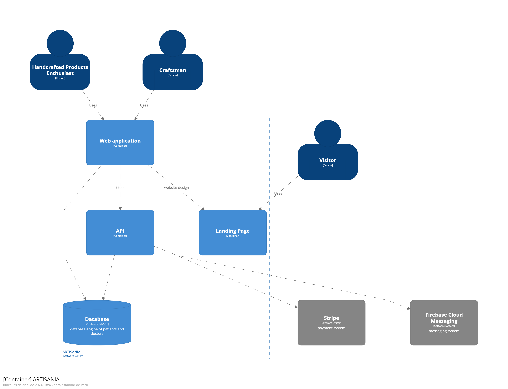
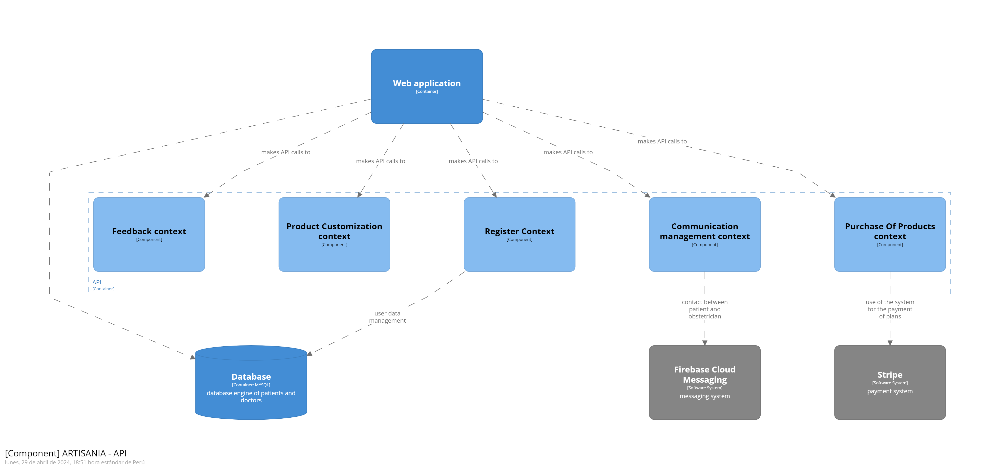

# **Tabla de Contenido**

- [Registro de Versiones](#registro-de-versiones)
- [Project Report Collaboration Insights](#project-report-collaboration-insights)
- [Student Outcome](#student-outcome)
- [Capítulo I: Introducción](#Capítulo-I-Introducción)
  - [1.1. Startup Profile](#11-startup-profile)
    - [1.1.1. Descripción de la Startup](#111-descripción-de-la-startup)
    - [1.1.2. Perfiles de integrantes del equipo](#112-perfiles-de-integrantes-del-equipo)
  - [1.2. Solution Profile](#12-solution-profile)
    - [1.2.1. Antecedentes y problemática](#121-antecedentes-y-problemática)
    - [1.2.2. Lean UX Process](#122-lean-ux-process)
      - [1.2.2.1. Lean UX Problem Statements](#1221-lean-ux-problem-statements)
      - [1.2.2.2. Lean UX Assumptions](#1222-lean-ux-assumptions)
      - [1.2.2.3. Lean UX Hypothesis Statements](#1223-lean-ux-hypothesis-statements)
      - [1.2.2.4. Lean UX Canvas](#1224-lean-ux-canvas)
  - [1.3. Segmentos objetivo](#13-segmentos-objetivo)
- [Capítulo II: Requirements Elicitation & Analysis](#Capítulo-II-Requirements-Elicitation--Analysis)
  - [2.1. Competidores](#21-competidores)
    - [2.1.1. Análisis competitivo](#211-análisis-competitivo)
    - [2.1.2. Estrategias y tácticas frente a competidores](#212-estrategias-y-tácticas-frente-a-competidores)
  - [2.2. Entrevistas](#22-entrevistas)
    - [2.2.1. Diseño de entrevistas](#221-diseño-de-entrevistas)
    - [2.2.2. Registro de entrevistas](#222-registro-de-entrevistas)
    - [2.2.3. Análisis de entrevistas](#223-análisis-de-entrevistas)
  - [2.3. Needfinding](#23-needfinding)
    - [2.3.1. User Personas](#231-user-personas)
    - [2.3.2. User Task Matrix](#232-user-task-matrix)
    - [2.3.3. User Journey Mapping](#233-user-journey-mapping)
    - [2.3.4. Empathy Mapping](#234-empathy-mapping)
    - [2.3.5. As-is Scenario Mapping](#235-as-is-scenario-mapping)
  - [2.4. Ubiquitous Language](#23-ubiquitous-language)
- [Capítulo III: Requirements Specification](#Capítulo-III-Requirements-Specification)
  - [3.1. To-Be Scenario Mapping](#31-to-be-scenario-mapping)
  - [3.2. User Stories](#32-user-stories)
  - [3.3. Impact Mapping](#33-impact-mapping)
  - [3.4. Product Backlog](#34-product-backlog)
- [Capítulo IV: Product Design](#Capítulo-IV-Product-Design)
  - [4.1. Style Guidelines](#41-style-guidelines)
    - [4.1.1. General Style Guidelines](#411-general-style-guidelines)
    - [4.1.2. Web Style Guidelines](#412-web-style-guidelines)
  - [4.2. Information Architecture](#42-information-architecture)
    - [4.2.1. Organization Systems](#421-organization-systems)
    - [4.2.2. Labeling Systems](#422-labeling-systems)
    - [4.2.3. SEO Tags and Meta Tags](#423-seo-tags-and-meta-tags)
    - [4.2.4. Searching Systems](#424-searching-systems)
    - [4.2.5. Navigation Systems](#425-navigation-systems)
  - [4.3. Landing Page UI Design](#43-landing-page-ui-design)
    - [4.3.1. Landing Page Wireframe](#431-landing-page-wireframe)
    - [4.3.2. Landing Page Mock-up](#432-landing-page-mock-up)
  - [4.4. Web Applications UX/UI Design](#44-web-applications-uxui-design)
    - [4.4.1. Web Applications Wireframes](#441-web-applications-wireframes)
    - [4.4.2. Web Applications Wireflow Diagrams](#442-web-applications-wireflow-diagrams)
    - [4.4.3. Web Applications Mock-ups](#443-web-applications-mock-ups)
    - [4.4.4. Web Applications User Flow Diagrams](#444-web-applications-user-flow-diagrams)
  - [4.5. Web Applications Prototyping](#45-web-applications-prototyping)
  - [4.6. Domain-Driven Software Architecture](#46-domain-driven-software-architecture)
    - [4.6.1. Software Architecture Context Diagram](#461-software-architecture-context-diagram)
    - [4.6.2. Software Architecture Container Diagrams](#462-software-architecture-container-diagrams)
    - [4.6.3. Software Architecture Components Diagrams](#463-software-architecture-components-diagrams)
  - [4.7. Software Object-Oriented Design](#47-software-object-oriented-design)
    - [4.7.1. Class Diagrams](#471-class-diagrams)
    - [4.7.2. Class Dictionary](#472-class-dictionary)
  - [4.8. Database Design](#48-database-design)
    - [4.8.1. Database Diagram](#481-database-diagram)
- [Capítulo V: Product Implementation, Validation & Deployment](#Capítulo-V-Product-Implementation-Validation--Deployment)
  - [5.1. Software Configuration Management](#51-software-configuration-management)
    - [5.1.1. Software Development Environment Configuration](#511-software-development-environment-configuration)
    - [5.1.2. Source Code Management](#512-source-code-management)
    - [5.1.3. Source Code Style Guide & Conventions](#513-source-code-style-guide--conventions)
    - [5.1.4. Software Deployment Configuration](#514-software-deployment-configuration)
  - [5.2. Landing Page, Services & Applications Implementation](#52-landing-page-services--applications-implementation)
    - [5.2.1. Sprint n](#521-sprint-n)
      - [5.2.1.1. Sprint Planning n](#5211-sprint-planning-n) -[5.2.1.2. Sprint Backlog n](#5212-sprint-backlog-n)
      - [5.2.1.3. Development Evidence for Sprint Review](#5213-development-evidence-for-sprint-review)
      - [5.2.1.4. Testing Suite Evidence for Sprint Review](#5214-testing-suite-evidence-for-sprint-review)
      - [5.2.1.5. Execution Evidence for Sprint Review](#5215-execution-evidence-for-sprint-review)
      - [5.2.1.6. Services Documentation Evidence for Sprint Review](#5216-services-documentation-evidence-for-sprint-review)
      - [5.2.1.7. Software Deployment Evidence for Sprint Review](#5217-software-deployment-evidence-for-sprint-review)
      - [5.2.1.8. Team Collaboration Insights during Sprint](#5218-team-collaboration-insights-during-sprint)
  - [5.3. Validation Interviews](#53-validation-interviews)
    - [5.3.1. Diseño de Entrevistas](#531-diseño-de-entrevistas)
    - [5.3.2. Registro de Entrevistas](#532-registro-de-entrevistas)
    - [5.3.3. Evaluaciones según heurísticas](#533-evaluaciones-según-heurísticas)
  - [5.4. Video About-the-Product](#54-video-about-the-product)

<h1>REGISTRO DE VERSIONES</h1>
<table>
    <tr>
        <th>Version</th>
        <th>Fecha</th>
        <th>Autor</th>
        <th>Descripcion de modificacion</th>
    </tr>
    <tr>
        <td>1.1</td>
        <td>Fila 1, Celda 2</td>
        <td>Fila 1, Celda 3</td>
        <td>Fila 1, Celda 4</td>
    </tr>
    <tr>
        <td>1.2</td>
        <td>Fila 2, Celda 2</td>
        <td>Fila 2, Celda 3</td>
        <td>Fila 2, Celda 4</td>
    </tr>
    <tr>
        <td>1.3</td>
        <td>Fila 3, Celda 2</td>
        <td>Fila 3, Celda 3</td>
        <td>Fila 3, Celda 4</td>
    </tr>
    <tr>
        <td>1.4</td>
        <td>Fila 4, Celda 2</td>
        <td>Fila 4, Celda 3</td>
        <td>Fila 4, Celda 4</td>
    </tr>
    <tr>
        <td>1.5</td>
        <td>Fila 5, Celda 2</td>
        <td>Fila 5, Celda 3</td>
        <td>Fila 5, Celda 4</td>
    </tr>
    <tr>
        <td>1.6</td>
        <td>Fila 6, Celda 2</td>
        <td>Fila 6, Celda 3</td>
        <td>Fila 6, Celda 4</td>
    </tr>
    <tr>
        <td>1.7</td>
        <td>Fila 7, Celda 2</td>
        <td>Fila 7, Celda 3</td>
        <td>Fila 7, Celda 4</td>
    </tr>
    <tr>
        <td>1.8</td>
        <td>Fila 8, Celda 2</td>
        <td>Fila 8, Celda 3</td>
        <td>Fila 8, Celda 4</td>
    </tr>
    <tr>
        <td>1.9</td>
        <td>Fila 9, Celda 2</td>
        <td>Fila 9, Celda 3</td>
        <td>Fila 9, Celda 4</td>
    </tr>
    <tr>
        <td>2.0</td>
        <td>Fila 10, Celda 2</td>
        <td>Fila 10, Celda 3</td>
        <td>Fila 10, Celda 4</td>
    </tr>
    <tr>
        <td>2.1</td>
        <td>Fila 11, Celda 2</td>
        <td>Fila 11, Celda 3</td>
        <td>Fila 11, Celda 4</td>
    </tr>
</table>

<h1>STUDENT OUTCOME</h1>
<table>
    <tr>
        <th>Criterio Específico</th>
        <th>Acciones realizadas</th>
        <th>Conclusiones</th>
    </tr>
    <tr>
        <td>- Student Outcome 5: La capacidad de funcionar efectivamente en un
equipo cuyos miembros juntos proporcionan liderazgo, crean un entorno de
colaboración e inclusivo, establecen objetivos, planifican tareas y cumplen objetivos.</td>
        <td>TB1:
            Alessandro Joaquin Bernardo Eusebio.- Propuse la idea de la startup como punto de partida para la investigación de mercado y la elaboración del needfinding en la fase inicial del proyecto. También participé en la creación de los repositorios necesarios, colaboré en la realización del informe y contribuí en la elaboración del landing page, así como en la creación de los wireframes y mockups correspondientes, incluyendo los flujos de navegación.</td>
        <td> </td>
    </tr>
</table>
<h1>CAPÍTULO I: INTRODUCCIÓN</h1>

<h2>1.1 Startup Profile</h2>
<h3>1.1.1 Descripción de la Startup</h3>

Artisanía es un marketplace único que reúne una amplia variedad de productos artesanales de alta calidad, 
junto con la posibilidad de personalizar ciertos artículos para satisfacer las necesidades individuales de nuestros 
clientes. Nos esforzamos por ofrecer una plataforma integral donde los amantes de la artesanía pueden descubrir, 
explorar y adquirir productos excepcionales de artesanos talentosos de todo el mundo. Además de proporcionar una 
experiencia de compra tradicional, también ofrecemos la opción de personalización, lo que permite a nuestros 
clientes colaborar directamente con los artesanos para crear piezas verdaderamente únicas y significativas.

<strong>Nuestra misión</strong> es democratizar el acceso a productos artesanales de calidad mientras celebramos la individualidad 
y la creatividad. Nos comprometemos a brindar a nuestros clientes una experiencia de compra en línea sin igual, 
donde puedan descubrir productos auténticos y también participar en el proceso creativo a través de la 
personalización. Al hacerlo, apoyamos a artesanos locales y promovemos la preservación de las habilidades 
artesanales tradicionales en un entorno moderno y globalizado.

<strong>Nuestra visión</strong> es establecer un estándar de excelencia en la industria del comercio electrónico, 
donde la personalización y la artesanía se fusionen de manera armoniosa con la conveniencia y la accesibilidad. 
Aspiramos a ser el destino preferido para aquellos que buscan productos únicos y personalizados, tanto para uso 
personal como para regalos especiales. A medida que crecemos, nos comprometemos a seguir innovando y mejorando 
nuestra plataforma para satisfacer las necesidades cambiantes de nuestros clientes y para seguir siendo líderes 
en la integración de la tecnología y la artesanía en el mercado en línea.

<h3>1.1.2 Perfiles de integrantes del equipo</h3>
| Fotos   | Descripción   | 
| ------- | ------------- | 
|  | Soy Santos Alexis Patazca Calderón, estudio Ingeniería de Software. Soy una persona responsable y soy respetuoso con mis compañeros de equipo, tengo buena comunicación con mis compañeros, me gusta seguir aprendiendo diversos lenguajes de programación para poder amplicar mis conocimientos. Tengo grandes expectativas en este curso y poder seguir aprendiendo. |

<strong>Alessandro Joaquin Bernardo Eusebio</strong>

Soy estudiante de la carrera de Ingeniería de software en la UPC, tengo conocimientos básicos sobre programación
 en el lenguaje de C++ y Python, conocimiento básico sobre configuración de redes y aplicación de la complejidad 
algorítmica. Tengo además conocimientos básicos sobre ciberseguridad y fundamentos de probabilidad y sus aplicaciones
. Siempre dispuesto a trabajar en equipo. Me considero una persona paciente y respetuosa que tiene como objetivo 
llevar a cabo este proyecto de forma satisfactoria.

<strong>Nicolas Andres Cortes Hidalgo</strong>

Soy un estudiante de la carrera de Ingenieria de Software en la UPC, tengo 20 años y curso actualmente el septimo 
 ciclo de la carrera. Me considero una persona responsable y activa en lo que respecta a todo tipo de trabajos. 
 Tengo conocimientos avanzados en Office y C++ e intermedios en Python y SQL. Mi objetivo dentro del curso es aprender 
 todo lo posible para poder emplear todos los conocimientos que adquiera en el futuro.

 
<strong>Franz Jair La Torre Valle</strong>

Soy estudiante de la carrera de Ingeniería de Software en la Universidad Peruana de Ciencias Aplicadas.
En mis tiempos libres me gusta leer, ver películas, practicar deportes y experimentar con nuevas actividades.
Mi compromiso con el equipo es siempre ser participativo, estar al pendiente de las actividades, responder cualquier duda y aportar en lo que se pueda. 

<h2>1.2 Solution Profilee</h2>
<h3>1.2.1 Antecedentes y problemática</h3>
<h4>1.2.1.1. What?</h4>

La problemática que tiene nuestro startup se centra en los artesanos peruanos que no se encuentran registrados y no pueden tener oportunidades para dar visibilidad a su negocio, si bien no representa un gran porcentaje en la producción nacional, pues cada artesano cuenta con historia de familias que van enseñando de generación en generación y su economía depende de esta labor.

<h4>1.2.1.2. When?</h4>

El estado ha ido apoyando a los artesanales, pero el problema aun persiste y existe un porcentaje de artesanales que se encuentran en situación de informalidad y por ende su economía no crece. Es por eso por lo que nuestra plataforma puede apoyar para que tengan mayores opciones de compra.

<h4>1.2.1.3. Where?</h4>

Nuestros usuarios podrán utilizar la plataforma que dispongan de acceso a internet. Está dirigido a los artesanos y turistas que les apasione la creatividad. 

<h4>1.2.1.4. Who?</h4>

Los involucrados en el problema son todos aquellos artesanos y turistas que desean utilizar una plataforma digital de una forma sencilla y segura para poder llevar a cabo sus pagos.

<h4>1.2.1.5. Why?</h4>

Se desarrolla el startup como respuesta de la necesidad de los artesanos que puedan ampliar el alcance de sus productos y poder vender sus productos. Asimismo, los clientes podrán visualizar nuevos productos y poder brindarles una nueva alternativa.

<h4>1.2.1.6. How?</h4>

La plataforma permitirá que los artesanos puedan compartir sus trabajos y podrán personalizar de acuerdo con el cliente. Se podrán registrar como artesanos y clientes, podrán disfrutar todos los beneficios que brindamos. 

<h4>1.2.1.7. How much?</h4>

Según COMEXPERU, el RNA se encuentran registrados 61 763 personas artesanales, el 62.6% no cuenta con RUC y esto afectaría a su negocio ya que no podrían participar en eventos y poder formalizar sus negocios y perderían muchas oportunidades

<h4>Antecedentes</h4>

Muchos artesanos se encuentran la informalidad y no pueden dar a conocer sus trabajos, algunos turistas tienen dificultades para poder ver una gran variedad de artesanos de diferentes lugares del país, esto puede ser por su forma de acceso. 

<h4>Problemática a resolver</h4>

Con todo lo propuesto, existe una necesidad de que exista una mejor forma de poder dar mayor visibilidad a los artesanos y poder brindarles un servicio que les sea accesibles y factibles, también brindaría un beneficio a muchos clientes que les gustaría poder realizar una compra segura. Asimismo, es necesario brindar nuevas formas de pago y poder usar la tecnología que les sea atractivo.

<h3>1.2.2. Lean UX Process</h3>
<h4>1.2.2.1 Lean UX Problem Statements</h4>
<h4>Comerciantes de Artesanias</h4>

El principal problema de los comerciantes de artesanías es que la gran mayoría de ellos se encuentran en la informalidad, a la vez que estos se suelen encontrar en centros especializados a la venta de las artesanías, esto provoca que una persona deba ir hasta el mismo lugar para encontrar una artesanía que le pueda gustar, sin contar además que los centros anteriormente mencionados no son muy abundantes en Lima, por lo que la distancia entre la persona interesada y el lugar en cuestión suele desmotivar a la persona.

Luego de haber entendido esto ¿Como podemos ayudar a los comerciantes a que estos tengan un mayor alcance para ofrecer sus productos al público en general?

<h4>Elaboradores de Artesanias</h4>

El problema de los comerciantes afecta también a los artesanos en cuestión, sin embargo, estos sufren un problema mayor.
Los artesanos elaboran sus artesanías con conceptos que ellos mismos conciben o bien tomando ideas de otros artesanos y adaptándolos a su estilo ¿Por qué esto es un problema? Porque esto provoca que el producto final va acorde a lo que el artesano quiso concebir, lo que provoca que quizás la artesanía no sea del agrado del consumidor, pues todos tenemos gustos diferentes.

Al haber explicado esto ¿Como podemos ayudar a que el artesano tenga a su disposición artesanías que sean del agrado de sus clientes?

<h4>1.2.2.2 Lean UX Assumptions</h4>
<h4>Business Outcomes</h4>

Creemos que lao artesanos y comerciantes de las artesanías necesitan una forma eficiente no solo de vender sus productos, sino de promocionarlos, ya que sus negocios en si representan una parte de la cultura de nuestro país pues toda artesanía representa a una cultura en cuestión de nuestro país, además de que una gran cantidad de artesanos y comerciantes dependen de la venta de las artesanías para lograr sustentarse tanto a ellos mismos como a sus familias.

Pensamos que las personas interesadas en artesanías de cualquier tipo verían con buenos ojos una manera más rápida y sencilla de poder encontrar algún tipo de artesanía que sea de su agrado.

Estimamos que el cliente, además de poder visualizar una gran cantidad de artesanías desde su hogar, también tendrá el beneficio de poder contactar con el artesano en cuestión para poder plasmar una idea que tenga el cliente en una artesanía creada por el artesano.

<h4>Users</h4>

Nosotros asumimos que nuestros principales usuarios serán los siguientes:

-Artesanos independientes que deseen que sus artesanías tengan un mayor alcance para así poder aumentar sus ganancias mensuales.

-Comerciantes de artesanías que posean acuerdos con artesanos para vender sus productos.

-Coleccionistas de artesanías y/o personas interesadas en las mismas las cuales buscan una forma más sencilla de encontrar productos artesanales.

<h4>User Outcomes</h4>

Lo que el usuario quiere lograr al utilizar nuestro servicio es:

<h4>Comerciantes y artesanos</h4>

-Incrementar el alcance de los productos ofrecidos.

-Incrementar el número de clientes que reciben mensualmente.

-Fabricar productos más atractivos para su público para así asegurar ventas de forma más efectiva.

<h4>Compradores de artesanías</h4>

-Tener un sistema más efectivo para comprar artesanías.

-Poder adquirir artesanías que se adapten más fácilmente a sus gustos.

<h4>Features</h4>

 Lo que busca la plataforma en cuestion es satisfacer las necesidades de nuestros segmentos ofrecidos, por lo que estas son las caracteristicas que se han incluido basandonos en nuestros usuarios

<h4>Artesanos</h4>

-Carga, subida y edicion de imagenes para poder mostrar de la mejor forma posible el producto ofrecido.

-Plataforma de contacto con los clientes para poder ofrecerles detalles tanto del producto como del precio del mismo.

<h4>Cliente</h4>

-Interfaz facil de navegar para poder encontrar la artesania deseada.

-Plataforma de contacto con los artesanos para poder crear una artesania que el cliente no encuentre dentro del sitio.

<h4>1.2.2.3 Lean UX Hypothesis Statements</h4>
<h4>1.2.2.4 Lean UX Canvas</h4>

<h2>1.3 Segmentos objetivo</h2>

Nuestra aplicación está dirigida a dos segmentos objetivos los cuales son:

<h4>- Cliente:</h4>

Aquellos amantes de la artesanía que buscan productos únicos y auténticos, así como aquellos en busca de regalos personalizados que reflejen su aprecio por la creatividad y la artesanía tradicional.

<h4>- Artesano:</h4>

Aquellos artesanos independientes y pequeñas empresas creativas que buscan expandir su alcance y conectar con una audiencia global a través de una plataforma que valora la calidad y la individualidad de sus creaciones.

<h1>CAPÍTULO II: REQUIREMENTS ELICITATION & ANALYSIS</h1>

<h2>2.1 Competidores</h2>
<h3>2.1.1 Análisis competitivo</h3>

<table>
  <tr>
    <th></th>
    <th>Artesanum 
</th>
    <th>ArtePeru </th>
    <th>Mercado Libre </th>
  </tr>
  <tr>
    <td><strong>Overview</strong></td>
    <td>Plataforma en línea que conecta a artesanos y diseñadores peruanos con clientes interesados en productos hechos a mano.</td>
    <td>Marketplace dedicado a la venta de productos artesanales peruanos, directamente de artesanos locales.	</td>
    <td>Plataforma en línea que ofrece una amplia gama de productos, incluyendo algunos artículos artesanales, aunque no es exclusivamente para este tipo de productos.	</td>
  </tr>
  <tr>
    <td><strong>Ventajas Competitivas</strong></td>
    <td>Enfoque exclusivo en productos artesanales peruanos. Mayor visibilidad para los artesanos locales.	</td>
    <td>Promoción y venta exclusiva de productos artesanales peruanos. Apoyo directo a la comunidad artesanal.	</td>
    <td>Amplia audiencia y reconocimiento internacional. Posibilidad de llegar a un gran número de clientes.	</td>
  </tr>
  <tr>
    <td><strong>Mercado Objetivo</strong></td>
    <td>Consumidores locales e internacionales interesados en productos artesanales peruanos.	</td>
    <td>Consumidores locales e internacionales que buscan productos artesanales auténticos de Perú.	</td>
    <td>Diversos segmentos de mercado tanto local como internacional, con énfasis en compradores en línea.	</td>
  </tr>
  <tr>
    <td><strong>Estrategias de Marketing</strong></td>
    <td>Promoción de la autenticidad y calidad de los productos artesanales peruanos. Colaboraciones con influencers y promoción en redes sociales.	</td>
    <td>Enfoque en la promoción de la cultura y la tradición peruana a través de productos artesanales. Campañas de marketing digital dirigidas a consumidores interesados en artesanía.	</td>
    <td>Publicidad en línea dirigida a diferentes segmentos de mercado. Promoción de productos artesanales como alternativas únicas y auténticas.	</td>
  </tr>
  <tr>
    <td><strong>Productos & Servicios</strong></td>
    <td>PAmplia variedad de productos artesanales peruanos, incluyendo textiles, cerámica, joyería, y decoración.	</td>
    <td>Productos artesanales peruanos que abarcan textiles, cerámica, joyería, y más.	</td>
    <td>Diversidad de productos, incluyendo algunos artículos artesanales peruanos entre una amplia gama de categorías.	</td>
  </tr>
  <tr>
    <td><strong>Precios & Costos</strong></td>
    <td>Precios variados según la artesanía y la calidad. Costos de producción pueden ser relativamente bajos para los artesanos.	</td>
    <td>Precios competitivos basados en el valor artesanal y la autenticidad. Costos de producción pueden influir en los precios finales.	</td>
    <td>Precios competitivos con una amplia gama de productos disponibles. Los costos de producción pueden variar dependiendo del tipo de producto.	</td>
  </tr>
  <tr>
    <td><strong>Canales de Distribución</strong></td>
    <td>Venta exclusiva en línea a través de la plataforma Artesanum Perú. Envío nacional e internacional disponible.	</td>
    <td>Venta en línea a través del sitio web de ArtePerú. Envío nacional e internacional disponible.	</td>
    <td>Principalmente venta en línea a través del sitio web de MercadoLibre Perú. Posibilidad de envío nacional e internacional.	</td>
  </tr>
  <tr>
    <td><strong>Fortalezas</strong></td>
    <td>Conexión directa entre artesanos y clientes. Promoción de la cultura peruana a través de productos artesanales.	</td>
    <td>Fomento de la artesanía peruana y apoyo directo a los artesanos locales. Enfoque exclusivo en productos auténticos de Perú.	</td>
    <td>Amplia audiencia y reconocimiento de marca. Infraestructura establecida para ventas en línea.	</td>
  </tr>
  <tr>
    <td><strong>Debilidades</strong></td>
    <td>Dependencia de la plataforma para la visibilidad y ventas. Competencia con otros marketplaces.	</td>
    <td>Limitación de alcance en comparación con marketplaces más grandes. Dependencia de la plataforma para la visibilidad y ventas.	</td>
    <td>Competencia con otros vendedores y productos en la plataforma. Dependencia de la plataforma para la visibilidad y ventas.			</td>
  </tr>
  <tr>
    <td><strong>Oportunidades</strong></td>
    <td>Crecimiento del comercio electrónico en Perú y el interés creciente en productos artesanales. Mayor acceso a mercados internacionales.	</td>
    <td>Potencial para colaboraciones con empresas o instituciones para promover la artesanía peruana. Crecimiento del turismo y el interés en la cultura peruana.	</td>
    <td>Crecimiento del comercio electrónico en Perú. Oportunidades de expansión a través de asociaciones con marcas locales.		</td>
  </tr>
 <tr>
    <td><strong>Amenazas</strong></td>
    <td>Cambios en las tendencias de consumo o en la economía que puedan afectar la demanda de productos artesanales. Competencia con productos masivos y fabricados en masa.</td>
    <td>Competencia con otras plataformas de venta en línea y productos importados.</td>
    <td>Cambios en las políticas de la plataforma que puedan afectar la visibilidad o la facilidad de venta para los artesanos.</td>
  </tr>
</table>
<h3>2.1.2 Estrategias y tácticas frente a competidores</h3>

<h2>2.2 Entrevistas</h2>
<h3>2.2.1 Diseño de entrevistas</h3>
<h4>Preguntas Generales</h4>

- ¿Cuál es su nombre completo y su edad?

- ¿A qué se dedica actualmente?

- ¿Cuáles son los dispositivos que utiliza principalmente?

- ¿Le es fácil adaptarse a sitios web o aplicativos móviles?

<h4>Artesanos</h4>

- ¿Cuántos años lleva dedicándose a la artesanía?

- ¿Cuáles son los medios donde promociona su artesanía?

- ¿Alguna vez ha vendido productos artesanales en alguna red social o plataforma?

Si fuera el caso 

- ¿Lo considera rentable? 

De lo contario

- ¿Qué te detiene al vender tus productos artesanales en línea?

- ¿Qué tipo de herramientas necesitarías para vender tus productos en línea de manera exitosa?

- ¿Qué características valorarías más al vender tus productos artesanales en línea?

- ¿Estás interesado en la posibilidad de personalizar productos para tus clientes?

- ¿Qué te motivaría unirte a una plataforma de marketplace de artesanías en línea?

<h4>Clientes</h4>

- ¿Con qué frecuencia compras productos artesanales?

- ¿Alguna vez realizó compras de productos artesanales en línea? ¿Qué tal fue su experiencia?

Si fuera el caso

- ¿Cómo se contactó con ellos? ¿Qué tal fue su experiencia?

De lo contrario

- ¿Tienes alguna preocupación en específico al comprar productos artesanales en línea?

- Cuando ve la información del producto en una plataforma digitales, ¿Considera que es suficiente para poder concretar la compra?

- ¿Considerarías la opción de personalización de productos artesanales importante al realizar una compra en línea?

-¿Qué características valorarías más en una plataforma de marketplace de artesanías?

- ¿Qué te gustaría ver en una plataforma de marketplace de artesanías?

- ¿Qué recomendación le darías a una persona que se dedica a la venta de artesanía para que pueda atraer clientes y se sientan seguros?

<h3>2.2.2 Registro de entrevistas</h3>
<h4>Cliente</h4>
<h4>Nombre: Nelson Maicol Guevara Oré</h4>

<strong>Link del video: </strong> https://drive.google.com/file/d/1IJhJeDnX3sVTXUSjfliCac4gZsyZghIE/view?usp=sharing

Nelson es universitario y también trabaja, los dispositivos que más utiliza son el celular y la laptop, él ha viajado y en ocasiones ha logrado comprar productos de artesanos, nos comenta que en una oportunidad logro comprar un collar en un lugar donde vendían a otros turistas. Nos cuenta que nunca realizó compras de productos de artesanía en páginas web porque le preocupa que la página no cuente con una seguridad eficaz para su compra, además teme que el producto sea distinto al que vio en la foto o llegue en malas condiciones. El considera que los productos en las páginas deben tener más información y fotos de diferentes ángulos del producto. Le gustaría que el producto de artesanía sea personalizable siente que sería un valor único. Comenta que una plataforma debe ser segura, intuitiva y amigable. Por último, la recomendación que les daría a los artesanos es que sea sinceros al vender su producto, que ofrezcan tal como se muestran en las imágenes y que sea de calidad.

<h4>Artesano</h4>
<h4>Nombre: Roy Romero Torres</h4>

<strong>Link del video: </strong> https://www.youtube.com/watch?v=CBFpRIXrUVo&ab_channel=AlessandroJoaquinBernardoEusebio

Roy Romero es un escultor dedicado que ha demostrado una fuerte dependencia de las ventas durante las temporadas turísticas o en ferias artesanales, sin embargo, su falta de adaptación a las tecnologías modernas se limita al uso de su celular, principalmente a través de WhatsApp para comunicarse con otros artesanos. A pesar de esto, muestra un interés en aprender y mejorar su presencia en línea, expresando su deseo de tener un marketplace diseñado específicamente para personas con necesidades similares a las suyas. 

<h4>Cliente</h4>
<h4>Nombre: Luis Bernardo Eusebio</h4>

<strong>Link del video: </strong> https://www.youtube.com/watch?v=fl4WpaItb6E&ab_channel=AlessandroJoaquinBernardoEusebio

Luis Francisco es un profesional de la carrera de derecho apasionado por viajar por el país, donde disfruta adquiriendo artesanías como recuerdos de sus travesías. Su preocupación principal radica en la calidad de los productos que adquiere, tanto en persona durante sus viajes como en línea. La posibilidad de comprar artesanías en línea le genera inquietud respecto a la calidad del producto recibido y su correspondencia con lo ofrecido en la publicidad. Sin embargo, está interesado en la idea de poder encargar productos personalizados mediante una comunicación directa con artesanos, permitiendo así una mayor seguridad en la calidad del producto final y una experiencia de compra más satisfactoria. 

<h3>2.2.3 Análisis de entrevistas</h3>

<h2>2.3 Needfinding</h2>
<h3>2.3.1 User Personas</h3>
<h3>2.3.2 User Task Matrix</h3>

<table>
 <tr>   <th rowspan = "2">User Task</th> <th colspan = "2">Segmento: Artesano </th> <th colspan = "2">Segmento: Cliente</th>   </tr>
 <tr>   <th>Frecuencia</th> <th>Importancia</th> <th>Frecuencia</th> <th>Importancia</th>   </tr>
 <tr>   <td>Buscar artesania</td> <td>Sometimes</td> <td>Low</td> <td>Always</td> <td>High</td></tr>
 <tr>   <td>Publicar artesania</td> <td>Always</td> <td>High</td> <td>Never</td> <td>low</td>   </tr>
 <tr>   <td>Comprar artesania</td> <td>Sometimes</td> <td>Low</td> <td>Always</td> <td>High</td>   </tr>
 <tr>   <td>Ingresar meteodo de pago</td> <td>Never</td> <td>Low</td> <td>Usually</td> <td>High</td>   </tr>
 <tr>   <td>Contactar artesano para la elaboracion de una artesania personalizada</td> <td>Usually</td> <td>Medium</td> <td>Sometimes</td> <td>Medium</td>   </tr>
 <tr>   <td>Contactar al cliente para acordar la entrega de la artesania comprada</td> <td>Always</td> <td>High</td> <td>Always</td> <td>High</td>   </tr>
 <tr>   <td>Valorar el servicio ofrecido por el artesano y la artesania comprada</td> <td>Never</td> <td>Low</td> <td>Usually</td> <td>High</td>   </tr>
</table>
 

<h3>2.3.3 User Journey Mapping</h3>
<h4>Segmento Cliente</h4>

<h4>Segmento Artesano</h4>

<h3>2.3.4 Empathy Mapping</h3>
<h4>Segmento Cliente:</h4>

<h4>Segmento Artesano</h4>

<h3>2.3.5 As-is Scenario Mapping</h3>
<h4>Segmento Cliente</h4>

<h4>Segmento Artesano</h4>

<h2>2.3 Needfinding</h2>

<h1>CAPÍTULO III: REQUIREMENTS SPECIFICATION</h1>
<h2>3.1 To-Be Scenario Mapping</h2>

<h4>Segmento Artesano</h4>

<h4>Segmento Cliente</h4>

<h2>3.2 User Stories</h2>
<table>
  <thead>
    <tr>
      <th># Orden</th>
      <th>User Story ID</th>
      <th>Título</th>
      <th>Descripción</th>
      <th>Criterios de Aceptación</th>
      <th>Story Points</th>
    </tr>
  </thead>
  <tbody>
    <tr>
      <td>1</td>
      <td>EP01</td>
      <td>Autenticación de usuario</td>
      <td>Como usuario nuevo, quiero poder registrarme e iniciar sesion en Artisania</td>
     <td>
        
<strong>Dado que</strong> el usuario desea registrarse e iniciar sesion,

        
<strong>Cuando</strong> acceda a Artisania,

        
<strong>Entonces</strong> debe poder registrar una cuenta nueva proporcionando un nombre de usuario, correo electrónico y contraseña válidos.

        
<strong>Entonces</strong> debe poder iniciar sesión con las credenciales previamente registradas.

      </td>
      <td>3</td>
    </tr>
    <tr>
      <td>2</td>
      <td>EP02</td>
      <td>Exploracion de productos artesanales</td>
      <td>Como usuario, quiero poder explorar una amplia variedad de productos artesanales de alta calidad.</td>
     <td>
        
<strong>Dado que</strong>  el usuario desea explorar los productos que ofrecemos,

        
<strong>Cuando</strong> ingrese a Artisania y seleccione el apartado de catálogo,

        
<strong>Entonces</strong> se le mostrara una amplia variedad de productos disponibles para su exploración.

      </td>
      <td>5</td>
    </tr>
    <tr>
      <td>3</td>
      <td>EP03</td>
      <td>Personalizacion de productos</td>
      <td>Como usuario, quiero tener la opción de personalizar ciertos productos según mis preferencias individuales, como el color, tamaño o diseño.</td>
     <td>
        
<strong>Dado que</strong> en usuario desea personalizar un producto en la plataforma de Artisania,

        
<strong>Cuando</strong> selecciona un producto específico para su compra,

        
<strong>Entonces</strong> debería tener la opción de personalizar aspectos como el color, tamaño y diseño según sus preferencias individuales.

        
<strong>Entonces</strong> después de realizar las personalizaciones deseadas, debería poder previsualizar cómo se verá el producto personalizado antes de confirmar su pedido.

      </td>
      <td>3</td>
    </tr>
    <tr>
      <td>4</td>
      <td>EP04</td>
      <td>Comunicacion con artesanos</td>
      <td>Como usuario, quiero poder comunicarme directamente con los artesanos para discutir las opciones de personalización.</td>
     <td>
        
<strong>Dado que</strong> en usuario desea comunicarse con un artesano para personalizar un producto,

        
<strong>Cuando</strong> el usuario selecciona un producto específico para personalizar,

        
<strong>Entonces</strong> seleccionara la opcion de comunicarse con un artesano.

        
<strong>Entonces</strong> se mostrara un cuadro de dialogo donde el usuario y artesano podran entablar comunicacion.

      </td>
      <td>8</td>
    </tr>
    <tr>
     <td>5</td>
     <td>EP05</td>
     <td>Acceso a información de contacto de artesanos</td>
     <td>Como usuario, quiero poder encontrar información de contacto adicional de los artesanos para comunicarme con ellos en caso de que no se encuentren disponibles dentro de la plataforma.</td>
     <td>
        
<strong>Dado que</strong> el usuario está interesado en personalizar un producto y desea entablar comunicacion con el artesano,

        
<strong>Cuando</strong> seleccione la opcion comunicarse con el artesano y no este dispobible,

        
<strong>Entonces</strong> se le mostrará al usuario la información de contacto del artesano, como un número de teléfono o correo electrónico, para que pueda comunicarse directamente con él y discutir posibles personalizaciones fuera de la plataforma.

     </td>
    <td>5</td>
    </tr>
    <tr>
      <td>6</td>
      <td>EP06</td>
      <td>Devolucion del producto</td>
      <td>Como usuario, quiero tener la tranquilidad de saber que si el producto no cumple con mis expectativas, puedo devolverlo y obtener un reembolso o un reemplazo</td>
     <td>
        
<strong>Dado que</strong> el usuario desea devolver un producto,

        
<strong>Cuando</strong> seleccione la opcion de devolucion de producto,

        
<strong>Entonces</strong> se le mostrara un formulario para iniciar el proceso de reembolso.

        
<strong>Entonces</strong> debera esperar respuesta de su solicitud de reembolso.

      </td>
      <td>2</td>
    </tr>
    <tr>
      <td>7</td>
      <td>EP07</td>
      <td>Comentarios sobre los productos personalizados</td>
      <td>Como usuario, quiero poder dejar comentarios y reseñas sobre los productos y la experiencia de personalización para ayudar a otros usuarios en sus decisiones de compra</td>
     <td>
        
<strong>Dado que</strong> el usuario desea agregar un comentario sobre un producto,

        
<strong>Cuando</strong> seleccione un producto dentro de la plataforma,

        
<strong>Entonces</strong> podra observar un apartado de comentarios donde tiene la opcion de colocar el suyo.

      </td>
      <td>3</td>
    </tr>
    <tr>
      <td>8</td>
      <td>EP08</td>
      <td>Metodos de pago</td>
      <td>Como usuario, quiero poder realizar el pago de mis compras de manera segura y conveniente utilizando diferentes métodos de pago, como tarjetas de crédito, transferencias bancarias o plataformas de pago en línea.</td>
     <td>
        
<strong>Dado que</strong> el usuario desea adquirir un producto,

        
<strong>Cuando</strong> seleccione la opcion de pagar,

        
<strong>Entonces</strong> podra observar un apartado donde pueda seleccionar su metodo de pago.

      </td>
      <td>5</td>
    </tr>
   <tr>
      <td>9</td>
      <td>EP09</td>
      <td>Muestra de trabajo del artesano</td>
      <td>Como artesano, quiero poder mostrar mi trabajo y habilidades, para que los clientes interesados puedan conocer mi estilo y experiencia.</td>
     <td>
        
<strong>Dado que</strong> el artesano desea mostar su trabajo,

        
<strong>Cuando</strong> seleccione la opcion de publicar articulos,

        
<strong>Entonces</strong> se le mostrara un formulario registrar los productos que ofrece.

      </td>
      <td>2</td>
    </tr>
   <tr>
      <td>10</td>
      <td>EP10</td>
      <td>Notificacion de solicitud de trabajo</td>
      <td>Como artesano, deseo recibir notificaciones instantáneas cuando un cliente solicite un producto personalizado, para poder comunicarme rápidamente con el cliente y entender sus necesidades específicas.</td>
     <td>
        
<strong>Dado que</strong> el artesano desea saber cuando recibe una solicitud de un cliente,

        
<strong>Cuando</strong> seleccione el apartado de notificaciones,

        
<strong>Entonces</strong> se le mostraran las solicitudes de confección que le han pedido.

      </td>
      <td>2</td>
    </tr>
    <tr>
      <td>11</td>
      <td>EP11</td>
      <td>Notificacion de solicitud de trabajo</td>
      <td>Como artesano, me gustaría tener la opción de gestionar mis pedidos y comunicaciones con los clientes directamente desde la plataforma del marketplace, para así tener un registro organizado de todas las transacciones y requerimientos de personalización.</td>
     <td>
        
<strong>Dado que</strong> el artesano entablar comunicacion con el cliente,

        
<strong>Cuando</strong> seleccione la opcion de comunicarse con el cliente,

        
<strong>Entonces</strong> se le mostraran un chat donde podra entablar comunicacion directa con el cliente.

      </td>
      <td>2</td>
    </tr>
   
    <tr>
  </tbody>
</table>
<h2>3.3 Impact Mapping</h2>

<h2>3.4 Product Backlog</h2>
<h2>3.3 Impact Mapping</h2>
<h2>3.4 Product Backlog</h2>

<h1>CAPÍTULO IV: PRODUCT UX/UI DESIGN</h1>
<h2>4.1 Style Guidelines</h2>
<h3>4.1.1 General Style Guidelines</h3>

Lenguaje:
El lenguaje que usaremos en nuestra aplicación es el lenguaje formal ya que queremos transmitirle al usuario seguridad y confianza en la información y recomendaciones que le brindemos.

Logo:
El logo de Artisania ha sido diseñado con un enfoque minimalista para reflejar la esencia de la marca y su propósito como una plataforma de marketplace para productos artesanales. Compuesto por rectángulos, este diseño ofrece una representación visual que combina simplicidad con significado.

Procederemos a mostrar los elementos seleccionados para el diseño de la aplicación.
Con respecto a la paleta de colores elegimos los siguientes:

Tipografía:
Para la tipografia escojimos Arial, ya que es conocida por su alta legibilidad y claridad, lo que la convierte en una excelente opción para la comunicación de mensajes importantes en la web. En una landing page, donde la información clave debe ser fácilmente accesible y comprensible para los usuarios, la tipografía Arial garantiza que el contenido sea claro y fácil de leer, lo que mejora la experiencia del usuario.

<h3>4.1.2 Web Style Guidelines</h3>

<strong>Tipografía</strong>
Al elegir Arial para la tipografía de la aplicación web de Artisania, se mantiene la consistencia visual con la marca. La tipografía utilizada en la aplicación debe reflejar la identidad visual de la marca para fortalecer su reconocimiento y cohesión. Como Arial es una fuente comúnmente asociada con profesionalismo y modernidad, se alinea bien con la imagen contemporánea que Artisania desea proyectar. A continuacion se daran los formatos de tamaño, estilo y formato de letra a utilizar:

<ul>
  <li>   Los botones con texto de la aplicación utilizarán el tamaño de letra 12 y estilo “Regular”.</li>
  <li>   Los títulos de la aplicación utilizarán el tamaño 16 en estilo “SemiBold”.</li>
  <li>   Los textos de la aplicación utilizarán el tamaño 14 en estilo “Regular”.</li>
  <li>   Los botones con texto utilizarán el tamaño de letra 18 y estilo “Medium”.</li>
  <li>   Los títulos utilizarán el tamaño 55 y estilo “Regular”.</li>
  <li>   Los subtítulos utilizarán el tamaño 28 en estilo “Medium”.</li>
  <li>   Los textos utilizarán el tamaño 18 en estilo “Regular”.</li>
  <li>   Los textos medianos utilizarán el tamaño 22 en estilo “Regular”.</li>
  <li>   Los textos pequeños utilizarán el tamaño 15 en “Light”.</li>
</ul>

<h2>4.2 Information Architecture</h2>
<h3>4.2.1 Organization Systems</h3>
<h3>4.2.2 Labeling Systems</h3>
<h3>4.2.3 SEO Tags and Meta Tags</h3>
<h3>4.2.4 Searching Systems</h3>
<h3>4.2.5 Navigation Systems</h3>

<h2>4.3 Landing Page UI Design</h2>
<h3>4.3.1 Landing Page Wireframe</h3>
<h3>4.3.2 Landing Page Mock-up</h3>

<h2>4.4 Web Applications UX/UI Design</h2>
<h3>4.4.1 Web Applications Wireframes</h3>
<h3>4.4.2 Web Applications Wireflow Diagrams</h3>
<h3>4.4.2 Web Applications Mock-ups</h3>
<h3>4.4.3 Web Applications User Flow Diagrams</h3>

<h2>4.5 Web Applications Prototyping</h2>

<h2>4.6 Domain-Driven Software Architecture</h2>
<h3>4.6.1 Software Architecture Context Diagram</h3>

<h3>4.6.2 Software Architecture Container Diagrams</h3>

<h3>4.6.3 Software Architecture Components Diagrams</h3>
<h4>- API </h4>

Muestra cada uno de nuestros modulos o grupos funcionales como particulares.

<h4>- Landing Page </h4>

Página diseñada específicamente para recibir a los visitantes que llegan a través de un enlace o anuncio, con el objetivo de convertirlos en clientes potenciales y que puedan ahcer uso de nuestros servicios.

<h4>- Web Application </h4>

Este diagrama muestra los recursos que permiten a nuestro sistema llevar un buen funcionamiento.

<h2>4.7 Software Object-Oriented Design</h2>
<h3>4.7.1 Class Diagrams</h3>
<h3>4.7.2 Class Dictionary</h3>

<h2>4.8 Database Design</h2>
<h3>4.8.1 Database Diagram</h3>

<h1>CAPÍTULO V: PRODUCT IMPLEMENTATION</h1>
<h2>5.1 Software Configuration Management</h2>
<h3>5.1.1 Software Development Environment Configuration</h3>
<h3>5.1.2 Source Code Management</h3>
<h3>5.1.3 Source Code Style Guide & Conventions</h3>
<h3>5.1.4 Software Deployment Configuration</h3>
<h2>5.2 Product Implementation & Deployment</h2>
<h3>5.2.1.1 Sprint Backlog 1</h3>
<h3>5.2.1.2 User Interface & Execution</h3>
<h3>5.2.1.3 Team Collaboration Insights</h3>

